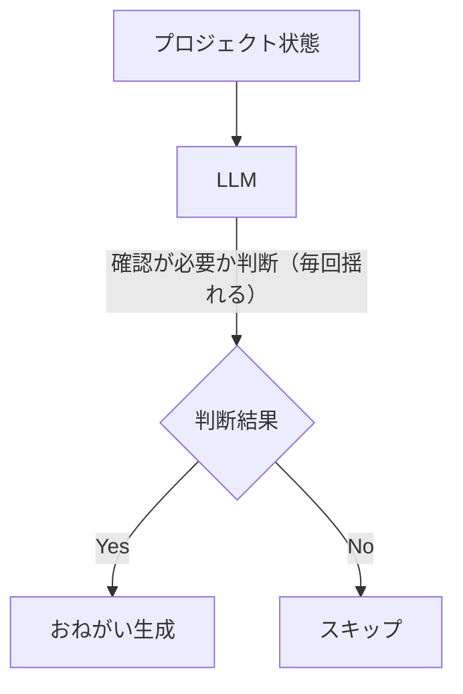
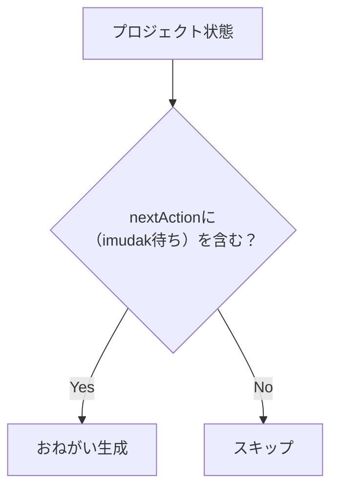

「レビューお願いします」という通知が、同じプロジェクトから3回来ました。

自律運用のAIエージェントを組んでいて、プロジェクトの進捗を定期的にチェックして人間への確認依頼を自動生成する仕組みを入れていました。そのエージェントが誤作動した話です。

## やっていたこと

個人の仕事管理に使っているシステムがあって、プロジェクトと記事の状態をAPIで管理しています。AIエージェントが定期的にそれを巡回して、自分の確認が必要なものを見つけたら「おねがい」という種別のタスクを自動生成する設計にしていました。

おねがいの生成ロジックはこんな流れでした。

1. プロジェクト一覧をAPIで取得する
2. 各プロジェクトの状態（nextActionなど）をLLMに渡す
3. LLMが「これは人間の確認が必要か？」を判断する
4. 必要と判断したらおねがいを生成する

LLMを使うことで、多様なプロジェクト状態を柔軟に判断してくれることを期待していました。

## 誤生成が多発した

しばらく運用していると、おかしなことが起き始めました。

- 同じプロジェクトへのおねがいが繰り返し生成される
- すでに対応済みのタスクに対して再度おねがいが来る
- 明らかに確認不要のプロジェクトにもおねがいが生成される

最初は設定ミスかと思って調べましたが、ロジックは正しく動いていました。LLMに同じプロジェクト状態を渡しても、返ってくる判断が毎回違うのです。「確認が必要」と言ったり、「問題ない」と言ったり。

LLMは確率的なモデルなので、同じ入力でも出力がぶれます。当然のことです。

## 原因は非決定性

LLMに判断を任せていたのが問題でした。

具体的には「nextActionが"imudak待ち"という文字列を含む場合」という判定を、LLMに自然言語で判断させていました。LLMは文章の意味を解釈して判断するので、同じ文字列でも「これは確認が必要」「これはエージェントが進めてよい」と解釈が揺れます。

温度パラメータを下げても改善しませんでした。根本的な問題は、判定ロジックがLLMの「解釈」に依存していたことです。

## 判断をコードに分離した

解決策はシンプルでした。LLMに判断させるのをやめて、スクリプトで判定するようにしました。

**Before: LLMが判断**



**After: コードが判断**



条件は文字列のマッチングで決定論的に判定するようにしました。nextActionの末尾に `（imudak待ち）` という文字列が入っていたら確認が必要、なければ不要。これで誤生成はほぼなくなりました。

## LLMをどこで使うか

判断をコードに移した後、LLMは「おねがいの文章を作る」部分で使っています。

コードで「このプロジェクトは確認が必要」と判定したあと、具体的にどんな内容でおねがいを作るか——タイトルや説明文——はLLMに生成させています。

```
コード: 「このプロジェクトは確認が必要」（決定論的な判定）
  ↓
LLM: 「タイトルは"記事レビュー: ○○"、説明は..."」（文章の生成）
```

LLMが得意なのは文章の生成や要約であって、条件の判定ではありません。ここに気づいてから、「どこをLLMにするか」の考え方が変わりました。

## 線引きの基準

| コードで書くべきもの | LLMに任せるもの |
| --- | --- |
| 条件の判定（Yes/No） | 文章の生成 |
| 状態遷移の制御 | 要約・説明の作成 |
| 数値の計算・比較 | 曖昧な情報の解釈 |
| データの検証 | コンテキストに応じた調整 |

「Yes/Noで答えられる判断」はコードで書いた方が安定します。「人間が読むための文章」はLLMが圧倒的に得意です。

## まとめ

LLMに判断を任せると、同じ入力でも結果が変わります。自律運用のエージェントでこれは誤動作として現れます。

「判断はコード、提案はLLM」を意識するようになってから、エージェントの動作が安定しました。LLMをロジックの中心に置くのではなく、決定論的な骨格の上でLLMを使う構造にするのがポイントだと思っています。
