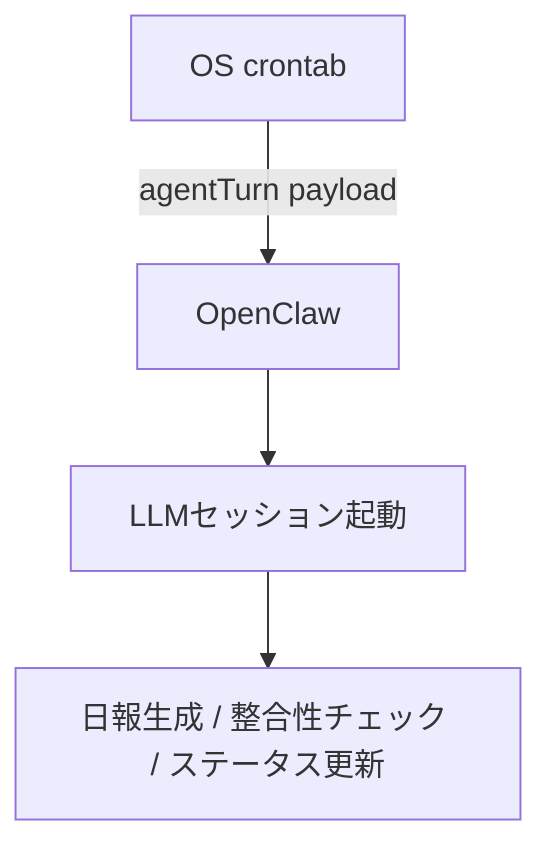
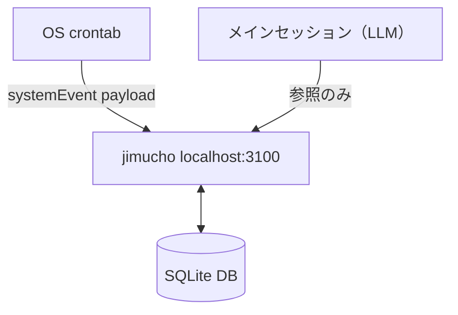
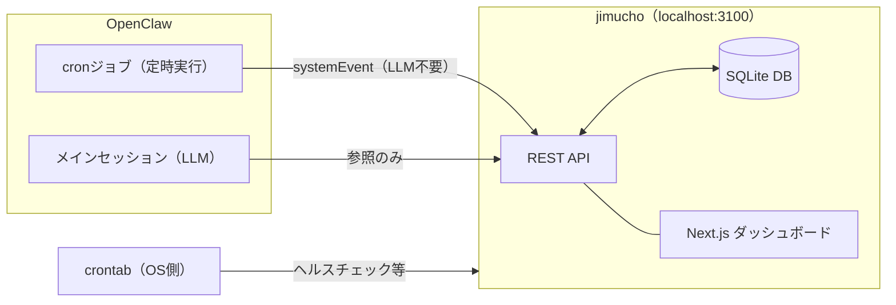

## 前提 — 1人で40件のプロジェクトを回している

合同会社を1人で経営しながら、AIエージェント（Claudeベース）を使って40件超のプロジェクトを並走させています。Webアプリ、Chrome拡張、Flutterアプリ、業務自動化ツールなど種類はバラバラで、コードを書くのはほぼ全てAIです。

しばらく運用を続けていると、設計ミスに気づきました。「LLMでやらなくていい処理にLLMを使っていた」ことです。

運用コストを実際に上げていた問題で、対処の過程でいくつかの気づきがありました。気づいた順に書きます。

## LLMに決定論的な処理をさせていた

### 何をやっていたか

AIエージェントの運用を始めた頃、「AIなんだから何でもやらせられる」という感覚でいろいろな処理をLLMにやらせていました。OpenClawのcronジョブは最初から動かしていましたが、そのペイロードに「agentTurn」——LLMセッションを起動する形式——を指定していました。

- 日報生成（「今日の作業記録を読んでサマリーを作って」）
- DBの整合性チェック（「jimuchoのデータとNotion側のデータを見て、ズレを検出して」）
- 定期レポート（「先週完了したプロジェクト一覧をまとめて」）
- ステータス更新（「ビルドが通ったからこのPJのステータスを更新して」）

どれも「できてしまう」処理です。AIに指示すれば実行してくれます。問題は、これらが全てLLMを経由する必要がなかったことです。

agentTurnを使う場合、LLMセッションの起動と終了にコストがかかります。処理そのものより「指示文を解釈する」「結果を自然言語で返す」部分のトークン消費が多く、日報1件の生成に指示文・確認・出力を含めると数千トークンが飛んでいました。これが毎日、複数回走っていました。

### LLMが不要な処理の特徴

これらの処理に共通しているのは「入力に対して出力が一意に決まる」という点です。

日報生成の場合、`memory/YYYY-MM-DD.md`を読んで、決まった形式で箇条書きにまとめるだけです。テンプレートと入力データが決まっていれば、出力も決まります。そこに「自然言語の理解」も「曖昧な判断」も必要ありません。

DBの整合性チェックも同様です。「AテーブルとBテーブルで同じIDが存在するか」「ステータスの値が想定の範囲内か」——これはSQLかシンプルなスクリプトで書けます。ステータス更新に至っては、条件と更新先が決まっているので、単なるCRUD操作です。

こういった処理をAIセッションで実行すると何が起きるか。まず、トークンを消費します。処理の内容そのものより、「指示文を解釈する」「結果を自然言語で返す」部分でトークンが膨らみます。

次に、コンテキストを汚染します。「日報作って」「DBチェックして」「ステータス更新して」をセッション中に行うと、それらの作業内容がコンテキストに残り続けます。実際に判断が必要な処理を行うときに、前の作業の残骸がコンテキストを圧迫していました。

## jimuchoの誕生

### 設計の出発点

この問題に気づいて、決定論的な処理をAIセッションから切り離すことにしました。その結果生まれたのがjimuchoです。

名前は「事務総長」の略です。管理業務を淡々とこなすシステムに、という気持ちで付けました。

設計の出発点は「AIから使いやすい形にする」という一点でした。Webアプリとして作ることも考えましたが、LLMが使う場合、UIは必要ありません。必要なのは「curlコマンド1つで結果が返ってくる」インターフェースです。

結果的にSQLite + REST APIというシンプルな構成にしました。

### システム構成の変化

決定論的処理をjimuchoに移すことで、以前のフローがどう変わったかを図にまとめます。

**Before — 決定論的処理もLLM経由**



**After — jimuchoが担う**



jimuchoのシステム構成は以下のとおりです。



### なぜSQLiteにしたか

RDBMSの選択肢はいくつかありました。PostgreSQL、MySQL、SQLiteの主要3択です。

PostgreSQLやMySQLを使わなかった理由は単純で、「デーモンを起動したくなかった」からです。1人で40件のプロジェクトを動かしている環境では、マネージドサービスのコストを増やしたくない、かつローカルではデータベースサーバーの管理コストを増やしたくない、という判断でした。

SQLiteは単一ファイルで完結します。バックアップは`cp`でできます。移行はファイルを持っていくだけです。ローカルで動く小規模な管理システムとして、これで十分でした。

スケールの問題を心配したこともありますが、40件のプロジェクトを管理するDBのサイズは数MB程度で、SQLiteのパフォーマンスが問題になる規模ではありません。「将来スケールするかもしれない」という理由でPostgreSQLにするより、今の規模に合った選択をしました。

### なぜRESTにしたか

GraphQLも一瞬検討しましたが、すぐに却下しました。理由は「AIが叩くとき、クエリを考えさせたくない」からです。

GraphQLはクエリを柔軟に書けますが、それはAIに「どのクエリを書くか判断させる」ことを意味します。RESTなら「このエンドポイントを叩けばこの情報が返ってくる」と固定できます。AIが叩く前に「何を取得すべきか」を判断する余地を最小化することが目的だったので、RESTの方が合っていました。

```
http://localhost:3100
├── /api/projects           # プロジェクト管理
├── /api/activity           # 活動ログ
├── /api/daily-report       # 日報生成（テンプレートベース）
├── /api/weekly-report      # 週次レポート生成
└── /api/check              # 整合性チェック
```

エンドポイントの設計でもう1つ意識したのは「LLMが処理しやすいレスポンスを返す」ことです。

受け取ったJSONをLLMが処理するとき、不要なフィールドが多いとコンテキストを圧迫します。「AIがこの情報で何をするか」を逆算してフィールドを設計しました。プロジェクト一覧なら、ID・名前・ステータス・残時間だけで十分です。作成日時や更新日時は、AIが判断に使わない限り返しません。

```json
{
  "id": 1,
  "name": "プロジェクトA",
  "status": "実装中",
  "remaining_hours": 8
}
```

### 日報生成エンドポイントの設計

日報生成の`/api/daily-report`は、AIセッションから切り離すにあたって一番慎重に設計したエンドポイントです。

以前のフローはこうでした。

1. cronがagentTurnを起動
2. LLMが`memory/YYYY-MM-DD.md`を読む
3. LLMが日報形式のMarkdownを生成
4. LLMが生成したものをDiscordに投稿

このフローでLLMが担っていた役割は「読んでまとめる」です。テンプレートが決まっているなら、これは不要です。

`/api/daily-report`は以下のことをします。

1. `memory/YYYY-MM-DD.md`を読む（日付はクエリパラメータで指定）
2. 作業ログを正規表現でパース
3. テンプレートにはめ込んでMarkdownを生成
4. そのままレスポンスとして返す

```bash
curl http://localhost:3100/api/daily-report?date=2026-02-18
```

AIセッションがこれを叩くとき、やることは「結果をどう使うか」の判断だけです。「Discordに投稿するか」「サマリーを別途作るか」——ここはLLMの仕事です。「どうまとめるか」をLLMがゼロから考える必要はありません。

## Notion廃止もこの流れで起きた

jimuchoを作る前は、業務データの管理をNotionで行っていました。AIがNotionのAPIを叩いてページを読み書きする構成です。

移行を決めたのは、レート制限とレスポンス構造の2点が原因でした。

Notionのレート制限は毎秒3リクエストです。プロジェクト一覧を取得してステータスを一括更新しようとすると、すぐ詰まります。バッチ処理を書こうとするたびにsleepを挟む処理が必要で、そのコードをAIが毎回書いていました。

レスポンス構造はより根本的な問題でした。Notionは「人間のUIを無理やりAPIにした」構造で、1つのページを読むためのJSONに、LLMが必要としない情報が大量に含まれています。

```json
// Notion APIのレスポンス（一部）— 必要な情報の周りに大量のメタデータ
{
  "object": "page",
  "id": "xxxxxx",
  "created_time": "2024-01-01T00:00:00.000Z",
  "last_edited_time": "2024-01-02T00:00:00.000Z",
  "properties": {
    "Name": {
      "id": "title",
      "type": "title",
      "title": [{"type": "text", "text": {"content": "プロジェクトA"}}]
    }
  }
}

// jimucho APIのレスポンス — 必要なものだけ
{
  "id": 1,
  "name": "プロジェクトA",
  "status": "実装中",
  "remaining_hours": 8
}
```

レスポンスのサイズ差は体感で10倍以上です。プロジェクト一覧を20件取得するとき、Notion経由だとAIのコンテキストに数千トークン使います。jimucho経由だと数百トークンで済みます。

### Notionからの移行

データ移行はNotionのCSVエクスポートを使いました。エクスポートしたCSVをPythonスクリプトでパースしてSQLiteに流し込む、というシンプルな手順です。Notionのブロック構造に依存した情報（リッチテキスト、入れ子のブロックなど）は捨てて、構造化できるフィールドだけ移行しました。

移行後に気づいたのは、「Notionのリッチな機能を業務管理に使っていなかった」という事実でした。使っていたのはテキストフィールド、セレクト、数値だけで、データベースとして同等の機能はSQLiteで十分でした。

Notionがもたらしていた価値は「人間が見やすいUI」です。ただ、AIが管理のメインになってからは、人間が直接Notionを見る機会が減っていました。jimuchoに管理画面を作ることで、人間が見る機能はそちらに移りました。

SQLite + REST APIに変えてから、AI側のコンテキスト消費が目に見えて減りました。必要な情報だけを返すAPIを自分で設計できるので、「LLMが処理しやすい形」で情報を渡せます。

Notion廃止はjimuchoを作ったことの副次効果でしたが、こちらの方が体感的なインパクトは大きかったです。

## cronジョブとの連携

決定論的な処理をjimuchoに移したことで、もう1つ変化がありました。これらの処理をcronジョブとして自動化できるようになったことです。

以前はcronのペイロードがagentTurnだったため、定時実行のたびにLLMセッションが起動していました。起動コストがかかるだけでなく、「処理が終わったかどうか」の確認も曖昧でした。「処理した」という応答が返っても、本当に処理できていたかどうかを別途確認する必要がありました。

jimuchoが独立したサービスとして常時起動するようになってから、cronペイロードをAPIの直接呼び出しに変更でき、LLMが動いていなくても基盤が機能します。

```bash
# Before: agentTurnでLLMセッションを起動（LLMが処理内容を考える）
# ペイロード: {"type": "agentTurn", "message": "日報を生成してDiscordに投稿して"}

# After: APIを直接呼び出し（処理内容は確定している）
0 9 * * * curl -s http://localhost:3100/api/daily-report?date=$(date +%Y-%m-%d)
0 9 * * * curl -s http://localhost:3100/api/check
0 8 * * 1 curl -s http://localhost:3100/api/weekly-report
```

もう1つ副次的な効果がありました。cronで失敗したときの診断が楽になったことです。LLMセッション経由だと「なぜ失敗したか」を追うのが難しかったのですが、APIの直接呼び出しになるとHTTPのステータスコードとログで即座に原因がわかります。

## 分離の基準

決定論的に作れるかどうかの判断基準はシンプルです。「入力が同じなら出力も同じになるか」——これがYesなら、LLMを使う必要がありません。

逆に「文脈を読む」「曖昧さを解消する」「複数の選択肢を判断する」が必要な処理は、LLMにしかできない仕事です。日報のフォーマットを決めてしまえばLLM不要ですが、「今週の振り返りをして次のアクションを考えて」はLLMの仕事です。

この分離を意識してから、AIセッションのコンテキストが「本当に必要な判断」だけに使われるようになりました。コンテキストは有限です。「日報作って」にコンテキストを使うより、「このPJをどう進めるか判断して」に使う方が、AIを使う意味があります。

現時点で、jimuchoが担っている処理は以下のとおりです。

| 処理 | 以前 | 現在 |
|------|------|------|
| 日報生成 | LLMセッション | /api/daily-report |
| 週次レポート | LLMセッション | /api/weekly-report |
| 整合性チェック | LLMセッション | /api/check |
| ステータス更新 | LLMセッション | /api/projects/:id (PATCH) |
| プロジェクト一覧取得 | Notion API経由 | /api/projects |

AIが担っている処理は「この情報をどう判断するか」「次に何をするか」という領域に絞られています。

## まとめ

「AIなんだから何でもやらせられる」という感覚で運用を始めた結果、LLMを使う必要がない処理にLLMを使い続けていました。

判断基準を「入力→出力が一意に決まるか」に絞ると、LLMが必要な処理とそうでない処理がはっきりします。決定論的に作れる処理をjimuchoというSQLite + REST APIのシステムに移したことで、AIセッションのコンテキストを本当に必要な判断だけに使えるようになりました。

副次効果として、Notionからの脱却とcronジョブのシンプル化も起きました。「LLMが処理しやすい形で情報を渡せる」インターフェースを自分で設計できることが、思いのほか大きな差になりました。

## 関連記事

- [Claude Codeのマルチエージェント実行を理解する — multi-agent-shogunから学ぶ](https://zenn.dev/imudak/articles/claude-code-multi-agent-shogun)（マルチエージェントの概念比較。jimuchoが生まれた文脈となるマルチエージェント運用の気づきを扱っている）
- [マルチエージェントAI開発の現実 — tmux手動オーケストレーションから自律実行フローへの移行記](https://zenn.dev/imudak/articles/multi-agent-orchestration-comparison)（shogun実運用からOpenClaw+Claude Code方式への移行。jimuchoはこの運用の中で生まれた）

---

*次の記事では、AIに指示を守らせようとして文書を増やしたら逆効果になった話——AGENTS.mdの肥大化と削減について書く予定です。*
