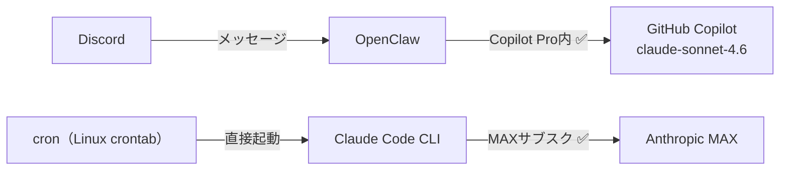

[前の記事](https://zenn.dev/imudak/articles/anthropic-openclaw-api-migration-part2)で「cronをLinux crontabに移行して解決した」と書きました。

その同じ日の午後、Anthropicコンソールを確認していて気づきました。cronを止めても、APIのクレジットが減り続けている。

## 今度は何が起きていたか

crontabへの移行は終わりました。Claude CodeもMAXサブスクで動いています。それでもAPI消費が止まりません。

「Discord会話が重いのかな」と漠然と思っていました。OpenClawとのやり取りが長くなると、過去ログも含めたコンテキスト全体を毎回送るので、1回の返信でそれなりのトークンを使います。

ちょうどその日はcrontabへの移行設定について長いやり取りをしていました。スレッドを追いながらコンソールの数字が動くのを見て確信しました。

改めてログを確認すると——会話ごとのトークン消費がかなり大きかったです。Discordのスレッド1本で数万トークン、長いやり取りだと10万を超えることもある。毎日複数スレッド立てていれば、それだけで$20を超えます。

**Discord対話部分がAPI費用の主役だった**という、ある意味シンプルな話でした。

LLMへのAPIリクエストはトークン単位の課金です。会話の場合、毎回「過去のやり取り全体＋今回のメッセージ」をコンテキストとして送ります。スレッドが進むほど1回のリクエストで送るトークン数が増えていきます。Claude Code（`claude -p`）はタスクファイルを渡す1回完結型なのでコンテキストが膨らみにくいですが、会話は本質的に蓄積するものです。

長いスレッド1本で10万トークンを超えることもありました。Claude Sonnet 4.6のAPIレートで計算すると、それだけで数ドルになります。

## GitHub Copilot経由という選択肢

OpenClawはモデルプロバイダーを切り替えられます。Anthropic APIキーだけでなく、GitHub Copilotもバックエンドとして使えます。

ここで課金モデルの違いが効いてきます。

Anthropic APIキーは**トークン単位の従量課金**です。会話が長くなるほど、スレッドが増えるほど費用が積み上がります。前述の通り、会話はコンテキストが蓄積する構造なので、使えば使うほど高くなります。

一方GitHub Copilot Proは**月額固定（約$10）のサブスクリプション**です。ただし、Claude Sonnet 4.6のようなプレミアムモデルは「Premium requests」という月間枠を消費します。GPT-4oなどの標準モデルは枠なしで使えますが、Claudeを使い続ける場合は上限を意識しておく必要があります。それでも、従量課金と違って**使うほど高くなる構造ではない**点が会話型の用途には合っています。

Claude Code（`claude -p`）はタスクを渡して結果を受け取る**バッチ型**の使い方です。1回のセッションが長くても、次のタスクは白紙から始まります。トークン消費は予測しやすく、MAXサブスクのような「重いタスクをまとめて処理する」用途に合っています。

OpenClawのDiscord対話は**会話型**です。コンテキストが蓄積し、応答のたびにトークンが増えます。この使い方はMAXよりCopilotの固定課金の方が構造的に合っています。

用途ごとに課金モデルを合わせる——それがこの構成の本質です。

ドキュメントを確認すると、`github-copilot/claude-sonnet-4.6` が利用可能とあります。Claude Sonnet 4.6がそのまま使えます。すでにVSCodeでCopilot Proを使っている場合は、文字通りゼロ追加コストです。

設定はコマンド一発です。

```bash
openclaw models auth login-github-copilot
```

ブラウザで `https://github.com/login/device` を開いてコードを入力するだけです。認証が通れば、OpenClawがCopilotトークンを自動管理します。

続けてデフォルトモデルを切り替えます。

```bash
openclaw models set github-copilot/claude-sonnet-4.6
```

これでDiscordへの返信が`github-copilot/claude-sonnet-4.6`経由になります。

## Anthropic APIキーを外す

Copilotに切り替えたので、`openclaw.json` の `ANTHROPIC_API_KEY` はもう不要です。残しておくとfallbackで使われる可能性もあるので、削除しておきます。

```json
// 変更前
{
  "env": {
    "ANTHROPIC_API_KEY": "sk-ant-..."
  },
  "agents": {
    "defaults": {
      "model": {
        "primary": "github-copilot/claude-sonnet-4.6",
        "fallbacks": [
          "anthropic/claude-sonnet-4-6"
        ]
      }
    }
  }
}

// 変更後
{
  "env": {},
  "agents": {
    "defaults": {
      "model": {
        "primary": "github-copilot/claude-sonnet-4.6",
        "fallbacks": [
          "github-copilot/gpt-4o"
        ]
      }
    }
  }
}
```

fallbackもCopilot内のモデルに変えておきます。これでAnthropicへの接続は完全に切れます。

## 現在の構成

結局3記事分かかりましたが、落ち着き先はこうなりました。



| 用途 | ツール | 課金先 |
|------|--------|--------|
| Discord対話（OpenClaw） | GitHub Copilot経由 | Copilot Proプラン内 |
| cronからの自律実行・実装 | Claude Code CLI（Linux crontab経由） | MAXサブスク |

Discord対話はCopilotプラン内なので追加費用はゼロです。Claude Codeの自律実行はMAXサブスクで動きます。AnthropicのAPIクレジットは使いません。

## Copilot Proの注意点

Premium requestsの残量は `https://github.com/settings/copilot` で確認できます。重い作業が続く時期は意識しておくといいです。

## ここまでの振り返り

- [Part 1](https://zenn.dev/imudak/articles/anthropic-openclaw-api-migration): Anthropic変更を受けてAPIキーに移行
- [Part 2](https://zenn.dev/imudak/articles/anthropic-openclaw-api-migration-part2): cronがAPIキーを消費していたのでLinux crontabに移行
- **Part 3（今回）**: Discord会話自体がAPIを食っていたのでGitHub Copilotに移行

3つの問題が同じ1日で連続して発覚しました。全部当日中に対応しています。「移行したら終わり」ではなく、実際に使いながら問題を見つけていくしかありませんでした。GitHub Copilotへの移行でようやく落ち着いた感があります。もうPart 4は書かなくていいはずです。
