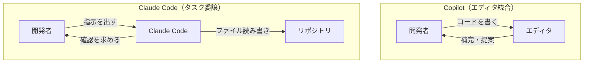

「GitHub CopilotとClaude Code、どっちがいいですか」と聞かれても、うまく答えられずにいました。両方使ってみると、これは「どちらが賢いか」の問いではなくて、「AIをどこに置くか」という設計思想の違いだと気づいたからです。

## Copilotの設計: エディタの中にいる

GitHub CopilotはVS Codeに統合されています。開いているファイルを見ながら、カーソルの先にくるコードを補完する。チャットで相談すると、選択しているコードに対して修正案や説明を出してくれます。

インラインの補完もAgentモードでの対話も、基本は「エディタを開いている自分のそばにいる」という構造です。Copilot（副操縦士）というネーミングはよく表していて、操縦席には自分がいます。AIはそこに座って一緒に判断してくれる存在です。

## Claude Codeの設計: タスクを委譲する

Claude Codeはターミナルから起動します。「このバグを直してほしい」「テストを書いてほしい」と指示を出すと、Claude Codeは自分でリポジトリを読み、ファイルを確認し、コードを書いて確認を求めてきます。

エディタを開かなくてもよく、コードを直接書く必要もありません——これがClaude Codeの動き方です。

## AIをどこに置くか

Copilotは「自分の手の延長」として機能します。Claude Codeは「タスクを任せる相手」として機能します。どちらが賢いかではなく、**AIをどこに置くか**という設計の違いです。

## 「書く時間」より「調べて整理する時間」が長い

この設計の違いが実感として効いてくるのは、実際の開発でコードを書いている時間より、調べて整理している時間の方が長くなっているからです。

- バグの原因を特定する
- 影響範囲を確認する
- 設計を検討する
- PRのコメントへの対応を整理する

Copilotはコードを書く作業を加速します。Claude Codeはこれら一連の作業ごと委譲できます。

Copilotが「書いている最中を手伝ってくれる」ツールなら、Claude Codeは「書く前から書いた後まで全部やってくれる」ツールです。

## どちらを選ぶか

| | GitHub Copilot | Claude Code |
|---|---|---|
| AIの位置 | エディタの中 | ターミナルの外 |
| 自分の役割 | コードを書く（AIが補助） | 指示を出してレビューする |
| 向いている作業 | 補完・提案・インライン編集 | タスク全体の委譲・実行 |
| 向いているスタイル | 自分でコードを書きたい | 結果をレビューしたい |

Copilotが向いているのは、自分でコードを書くスタイルを維持しつつ、補完や提案で効率を上げたい場合です。Claude Codeが向いているのは、「この機能を実装してほしい」と丸ごと任せてレビューするスタイルに移行したい場合です。

どちらが「正解」かではなく、自分の開発スタイルに合うかどうかの話です。

料金の比較については[別の記事](https://zenn.dev/imudak/articles/copilot_vs_claude_pricing)で詳しく書いています。

## まとめ

「どちらが賢いか」ではなく、「AIをエディタの中に置くか、タスクの委譲先として置くか」——この選択が日々の開発スタイルの根本に関わります。

Copilotの設計思想は「コードを書く自分を強化する」、Claude Codeの設計思想は「コーディング作業ごと委譲する」です。どちらを選ぶかは、自分がどういう開発スタイルを目指すかによります。
