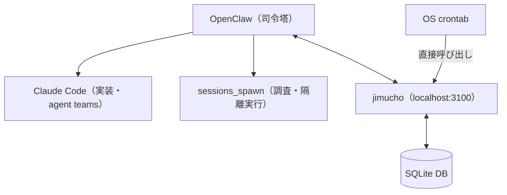

## きっかけ

QiitaでClaude Codeを使った「第二の脳」構築の記事を読みました。yamapiiii氏の[「Claude Codeで「第二の脳」を作り、最終的にAIが自律運用するようになった話」](https://qiita.com/yamapiiii/items/cc2450f410b64329d275)です。

読み始めて「自分のやっていることと近いな」と思い、読み終えて「全然違う」と感じました。思想の根は似ているが、実装の経緯と構造がかなり違います。比較して整理しておく価値があると思いました。

## yamapiiii氏のシステム概要

14個のカスタムコマンドと13体のエージェント定義を持つ、かなり作り込まれた構成です。

ポイントは**brain/project分離**です。思考リポジトリ（brain）と実装リポジトリ（project）を明示的に分けています。GitHubのIssue・Milestoneはbrainリポジトリに集約し、projectリポジトリからは参照のみ。この分離原則を「brain = Why/What、project = How」と表現しています。

自律化は3層構造です。

| 層 | 役割 |
|----|------|
| Layer 1（実行層） | 14コマンド × 13エージェントのチェーン実行 |
| Layer 2（判断層） | オーケストレーターが優先度スコアリング・ブロッカー検出 |
| Layer 3（常時稼働層） | GitHub Actions / cronで毎朝Inbox整理・週次レビュー |

CLAUDE.mdをAI向けの行動指針として使い、AIをコーディングアシスタントではなく「思考パートナー」として設計している点が特徴的です。

## 自分のシステム構成

現時点での構成です。



- **OpenClaw**: AI司令塔。heartbeat（定期巡回）・cronジョブ・sessions_spawn（隔離セッション実行）を提供
- **jimucho**: SQLite + REST APIの管理システム（localhost:3100）。日報生成・整合性チェック・ステータス更新など決定論的な処理を担当
- **memory/YYYY-MM-DD.md**: プロジェクト内の作業ログ・メモ

jimuchoはNotionのAPIに限界を感じて作ったシステムです。詳細は別記事（[LLMに決定論的な処理をさせていた話](https://zenn.dev/imudak/articles/ai-autonomous-workflow-delegation)）に書いていますが、「入力が同じなら出力も同じになる処理はLLMに任せない」という判断から生まれました。

## 思想的な近似点

「似ているな」と感じた理由はいくつかあります。

**AIが読む情報をGit管理する**という選択が共通しています。yamapiiii氏のbrainリポジトリはAIが直接参照する情報源です。自分のシステムでも、CLAUDE.md・AGENTS.md・memory/ディレクトリはGit管理で、AIの行動指針と作業履歴はすべてファイルベースです。

もう1つは**Notionからの脱却**です。yamapiiii氏は「NotionよりGitの方がAI連携に優れる」という判断で移行しています。自分はNotionのレート制限（毎秒3リクエスト）と冗長なレスポンス構造に嫌気が差し、jimuchoを作ってSQLite + RESTに移行しました。着地点は違いますが、「人間のUIよりAIが処理しやすい形を優先する」という判断軸は同じです。

3層の自律アーキテクチャという構造も共通しています。自分の場合はOpenClawのheartbeat・cronジョブ・sessions_spawnの3層ですが、「定時実行が基盤を支え、判断はLLMが行い、実行は専門エージェントに委ねる」という層の分け方は似ています。

## 構造の差異

一方、実装の発想は大きく異なります。

| 観点 | yamapiiii方式 | 自分の方式（jimucho + OpenClaw） |
|------|-------------|--------------------------------|
| 知識管理 | brainリポジトリに集約 | memory/ファイル + jimucho（SQLite）に分散 |
| 設計の出発点 | 「第二の脳」という上位概念 | 問題解決の積み上げ |
| コマンド定義 | 14個の明示的なカスタムコマンド | cronジョブ + claude -p |
| エージェント定義 | 13体（.claude/agents/） | sessions_spawn + Claude Code agent teams |
| 常時稼働 | GitHub Actions / cron | OpenClawのheartbeat + OS crontab |
| 管理データ | Git（唯一の情報源） | jimucho（SQLite） |

最大の違いは**情報の集約度と設計の意図**です。

yamapiiii氏のシステムは、brainリポジトリという単一の情報源にすべての知識を引き寄せる設計です。GitHubのUIで人間が確認でき、AIがファイルをそのまま読める。この一貫性は、システム全体を見通す設計思想から来ています。

自分の場合、情報の置き場所が分散しています。構造化データはjimuchoのSQLite、作業メモがmemory/ファイル、AI行動指針がAGENTS.mdという具合にバラバラです。「決定論的処理をLLMから切り離す」という課題を解決するたびにパーツが増えた結果で、全体設計として意図したわけではありません。

## 14コマンドという設計判断

yamapiiii氏の14個のカスタムコマンドは「1コマンド = 1つの完結した行動」として定義されています。

```text
/decompose  → ゴール → MS → タスクの3層分解
/work       → Issue実行 → 完了 → クローズ
/orchestrate → 優先度自動判定 → Issueチェーン実行
/deep-research → 複数エージェント並列調査
```

自分はこれに相当する操作をcronジョブと`claude -p`の組み合わせで実現しています。コマンドとして名前をつけて定義するのではなく、スケジュールと指示文のセットとして保持している形です。

コマンドとして定義する方式は、人間が意図的に呼び出す操作に向いています。自分の運用では多くの操作がcronで自動発火するため、コマンドとして呼び出す機会が少ない事情もあります。どちらが良いかは、自律化の度合いと人間の関与パターンによって変わりそうです。

## 「brain/project分離」の考え方

yamapiiii氏の「brain = Why/What、project = How」という分離は、読んで腑に落ちました。

自分のシステムにはこの分離が明示的にありません。OpenClawのAGENTS.mdには方針と手順が混在していて、以前記事にした[AGENTS.mdの肥大化問題](https://zenn.dev/imudak/articles/ai-agent-secretary-general)に繋がっています。「なぜやるか」と「どうやるか」が混在しているため、AIのコンテキスト負荷が高くなっていました。

jimuchoを作ったときの発想——「決定論的処理をLLMから切り離す」——も、本質的には同じ問題への対処です。「何を判断させるか」と「何を実行させるか」を分離する。yamapiiii氏は情報の抽象度で分離し、自分は処理の性質で分離しています。

## Gitを「情報源」にする選択

NotionからSQLiteに移行した自分と、NotionからGitリポジトリに移行したyamapiiii氏。出発点は同じでも着地が違います。

自分がGitではなくSQLiteを選んだのは、プロジェクト管理データ（ステータス・時間・進捗）はテーブル構造に向いていると判断したからです。AIがcurlで叩けて、必要なフィールドだけのJSONが返ってくる——これはREST APIとSQLiteの組み合わせが適しています。

一方、「なぜこのプロジェクトをやるか」「どう進めたか」という文脈の情報はMarkdownが向いています。yamapiiii氏のbrainリポジトリはここに特化していて、Gitに置くことでAIが直接読める。この判断は理にかなっています。

整理すると、「管理データ → SQLite（jimucho）」「文脈・知識 → Git（memory/）」という構成は自分も使っています。yamapiiii氏との違いは、後者の「文脈・知識」部分の設計が場当たり的だという点です。brainリポジトリのように「Why/Whatを集約する場所」として意識的に設計したことはありませんでした。

## まとめ

比較して見えたのは「思想は近いが、設計の意図的さが違う」という点です。

共通しているのは、GitとCLAUDE.mdをAI連携の基盤とする選択、Notionより軽量なシステムへの移行、3層構造による自律化の方向性です。

違うのは、情報の集約度（一元化vs分散）、コマンド定義（明示的vs暗黙的）、そして設計の出発点（上位概念から降ろすvs問題解決の積み上げ）です。

自分のシステムに「文脈・知識を集約するbrainリポジトリ」という概念が欠けていたのは確かです。jimuchoでデータの整理はできていますが、「なぜこのプロジェクトをやるか」という文脈は各プロジェクトのmemory/ファイルに散らばっていて、参照しにくい状態が続いています。「問題が起きたから対処した」の積み上げでシステムを作ると、こういう設計の歪みが出てくるものだと改めて思いました。

---

:::message
この記事で紹介した自分のシステムについては以下の記事もご参照ください。
- [LLMに決定論的な処理をさせていた話 — jimuchoの誕生](https://zenn.dev/imudak/articles/ai-autonomous-workflow-delegation)
- [AI司令塔×マルチエージェント：OpenClaw + Claude Codeハイブリッド運用体制](https://zenn.dev/imudak/articles/hybrid-ai-operation)
- [AIエージェントに「事務総長」を作らせた話](https://zenn.dev/imudak/articles/ai-agent-secretary-general)
:::
