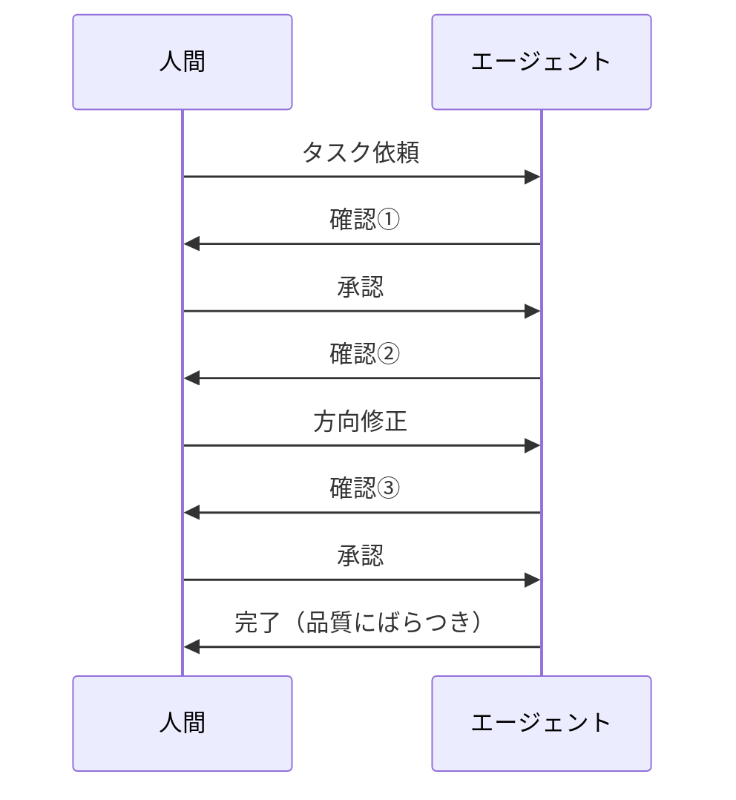
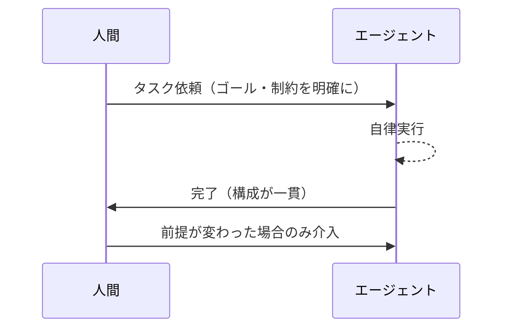

Claude Codeに大きなリファクタリングを頼んで、途中で「そこはこうした方がいいんじゃないか」と口を出したことがあります。エージェントは律儀に対応してくれましたが、最終的な成果物は自分が口を出す前より悪くなっていました。

これを何度か繰り返して気づきました。自分の介入が邪魔になっていた、ということに。

## 「Human in the Loop」という考え方

AIシステムの設計でよく語られる概念に**Human in the Loop**があります。AIの判断に対して、重要なポイントで人間が確認・承認する仕組みです。医療診断AIや自動運転など、ミスが取り返しのつかない領域で重視されてきました。

背景にある前提は「人間はAIより賢い」「人間が介入することで品質が上がる」というものです。AIが苦手だった時代には、この前提は正しかったと思います。

ただ、2025年〜2026年にかけて実感していることは、「この前提が崩れてきた領域がある」ということです。

## 介入が品質を下げた経験

Claude Codeを使ったコーディングで、介入の悪影響を実感した場面がいくつかあります。

### リファクタリング中の干渉

大きなリファクタリングをエージェントに頼んだとき、作業の途中で「この関数、もう少し分割した方がいいんじゃないか」と追加指示を入れました。エージェントは指示に従いましたが、その後の作業の流れが変わって、最終的な構成が当初の設計より複雑になりました。

ひとまとまりの作業を中断させて部分的な指示を入れることで、エージェントが持っていたプランが崩れたのだと思います。

### デバッグ中の割り込み

バグの原因を探っているエージェントに「そっちじゃなくてこっちを見て」と誘導したことがあります。確かに自分の仮説は外れていて、エージェントが最初に着目していた箇所が正解でした。経験的な「これが原因だろう」という勘が、かえって遠回りさせました。

### 承認ステップの摩擦

「重要な変更は確認してから進めて」という設定にしていた時期があります。エージェントが確認を求めてくるたびに承認していましたが、実質的にはこれは「作業を止めて再確認させる」動作でした。セッションが長くなるほど確認回数は増えて、作業効率も落ちます。最終的に、コードの品質ではなく承認の回数を増やしていただけでした。

## なぜ介入が品質を下げるのか

コンテキストの非対称性が主な原因だと思っています。エージェントはセッション中に積み上げてきた文脈を持っています。途中で入る指示は、その文脈の外からやってくるノイズになりやすいです。

もう1つは**確証バイアス**です。人間は経験から「これが原因だろう」「こうするべきだろう」という仮説を持ちます。その仮説を持ち込むことで、AIが広く探索するはずだった空間を狭めてしまいます。

AIが苦手だった時代は、人間が介入することで「より広い判断軸」を持ち込めていました。今はコーディングの実装レベルでは、AIの方が広く、細かく、一貫して探索できます。

## 人間が介入すべき場面

全てに介入しなくていい、という話ではありません。

介入すべきなのは「AIが持っていない文脈を補う場面」だと思っています。

- ゴールの再定義 —「何を作るか」の判断は人間にしかできません。仕様が変わったとき、AIはそれを知りません
- ビジネス文脈の注入 —「この機能はリリースを急ぐ」「このユーザーには見せたくない」といった外部文脈
- 倫理・コンプライアンスの判断 — 技術的に正しい答えでも、出してはいけない情報がある場合
- 前提が間違っていると気づいたとき — エージェントが解こうとしている問題が、そもそも違う問題だったとき

逆に、これ以外の局面——実装方法の選択、デバッグの手順、コードの構造——への介入は、慎重になった方がいいと思っています。

## Before/After: 介入スタイルの変化

運用を変える前後で、どう変わったかを図にまとめます。

**Before — 都度確認しながら進める**

**After — 最初に文脈を渡して任せる**

変えてから、一気通貫で作業させたときの方が、途中で方向修正を入れたときより構成はきれいなことが多いと感じています。計画が一貫して保たれているからだと思います。

## Human in the Loopは不要という話ではない

Human in the Loopという概念自体は今でも重要です。

ただ設計の前提が変わってきました。「AIは判断を間違えるから、人間がチェックする」という使い方から、「AIが得意な領域とそうでない領域を分けて、適切な場面で人間が入る」という使い方に変わっていくべきだと感じています。

介入のコストは無料ではありません。確認ステップを増やすことは、セッションの流れを止めることであり、文脈を分断することでもあります。

## まとめ

- AIが得意な領域（コーディング実装、デバッグ、リファクタリング）では、途中の介入が品質を下げることがある
- 原因はコンテキストの分断と、人間が持ち込む確証バイアス
- 介入すべきは「AIが持っていない外部文脈を補う場面」に絞る
- 最初にゴールと制約を明確化して任せると、成果物の一貫性が上がった

「Human in the Loop」をやめる、というより「どこで入るか」の設計を変える——それが今の考えです。
