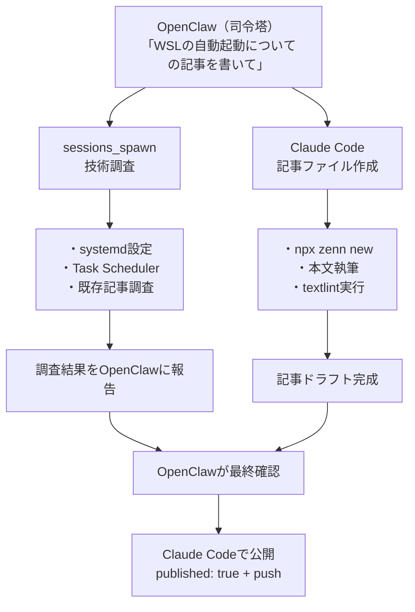
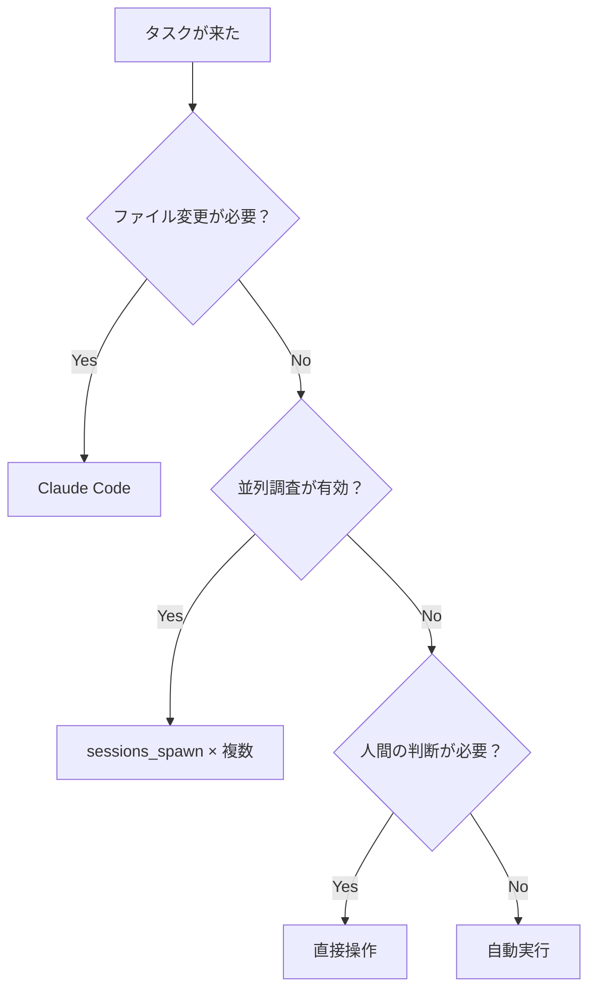

## はじめに

AIエージェントを使った開発を進めていると、あるとき壁にぶつかります。

- OpenClawのセッションで調べ物をしたが、その結果をClaude Codeに手動でコピペしている
- Claude Codeで書いたコードのレビューを、また別のセッションに貼り付けている
- 各チャンネルがサイロ化して、情報共有がすべて手作業

つまり「AIは賢いのに、AI同士の連携は人間が全部やっている」という状態です。

本記事では、**OpenClawを司令塔**として、`sessions_spawn`（サブエージェント）とClaude Code agent teamsを組み合わせた**ハイブリッド運用体制**を構築した実践記録をまとめます。

## 対象読者

- OpenClawやClaude Codeを使い始めた開発者
- AIエージェントの並列運用に興味がある方
- 手動での情報連携に限界を感じている方

## 背景：サイロ化問題

AI開発ツールを複数使っていると、以下のような状況に陥ります。


各ツールは単体では優秀ですが、連携部分がボトルネックになります。タスクが増えるほど「AIに指示を出す作業」自体が負荷になるという皮肉な構図です。

## ハイブリッド運用体制の全体構造

この問題を解決するために構築した体制が、以下のハイブリッド構造です。


OpenClawが全体を統括し、タスクの性質に応じて適切なチャンネルに振り分けます。

### 各コンポーネントの役割

| コンポーネント | 役割 | 得意なこと |
|------------|------|---------|
| OpenClaw（司令塔） | タスク分解、振り分け、進捗管理 | 全体俯瞰、判断 |
| sessions_spawn | 並列調査、情報収集 | Web検索、ドキュメント分析 |
| Claude Code agent teams | コード変更、ファイル操作 | 実装、テスト、git操作 |
| 直接操作（人間） | 最終判断、承認 | 品質確認、方針決定 |

## タスク振り分け基準

どのチャンネルにタスクを振るかは、以下の基準で判断します。

### sessions_spawnを使う場合

調査系・分析系のタスクに向いています。

```text
適するタスク：
✅ 複数ドキュメントの横断調査
✅ 技術選定のための比較分析
✅ エラーの原因調査
✅ 既存コードベースの構造分析

適さないタスク：
❌ ファイルの直接編集
❌ コマンドの実行
❌ git操作
```

OpenClawからサブエージェントを起動する例です。

```text
（OpenClawへの指示）
以下の3つを並列で調べてほしい：
1. React 19の主要な破壊的変更
2. 現在のプロジェクトで影響を受けるコンポーネント
3. マイグレーションガイドの要約

それぞれsessions_spawnで実行して、結果をまとめて報告して。
```

### Claude Codeを使う場合

実装系・ファイル操作系のタスクに向いています。

```text
適するタスク：
✅ コードの実装・修正
✅ テストの作成・実行
✅ リファクタリング
✅ git commit / push

適さないタスク：
❌ 大量のWeb検索
❌ 長時間の調査タスク
❌ OpenClawの設定変更
```

### 直接操作が必要な場合

最終的な意思決定は人間が行います。

```text
人間が判断すべきもの：
• 本番環境へのデプロイ可否
• 設計方針の最終決定
• セキュリティに関わる変更の承認
• 外部サービスの契約・設定変更
```

## Claude Code自動操作の方法

ハイブリッド運用の要は、OpenClawからClaude Codeを自動で操作できることです。`--dangerously-skip-permissions`フラグと`-p`（プロンプト直接指定）を組み合わせます。

### 基本的な使い方

```bash
# -p でプロンプトを直接渡し、非対話的に実行
claude -p "src/utils/helper.tsのformatDate関数にJSDocコメントを追加して"

# --dangerously-skip-permissions で権限確認をスキップ（自動化用途）
claude --dangerously-skip-permissions -p "npm testを実行して結果を報告して"
```

:::message alert
`--dangerously-skip-permissions`は名前の通り危険なフラグです。ファイル削除やgit pushなどの操作を確認なしで実行します。信頼できる環境・タスクでのみ使用してください。
:::

### OpenClawからの自動実行例

OpenClawのToolsでシェルコマンドを実行し、Claude Codeに作業を委譲する流れです。

```bash
# OpenClawからClaude Codeにタスクを投げる
claude --dangerously-skip-permissions -p "
以下のタスクを実行してください：
1. src/components/Button.tsx のユニットテストを作成
2. テストを実行して全件パスすることを確認
3. 結果をJSON形式で出力

作業ディレクトリ: /home/user/my-project
"
```

### agent teamsとの組み合わせ

Claude Code内部のagent teams機能を使えば、さらに並列度を上げられます。

```bash
# Claude Code agent teamsを活用する例
claude --dangerously-skip-permissions -p "
以下のタスクをagent teamsで並列実行してください：

チーム構成:
- researcher: APIドキュメントの調査
- implementer: 実装担当
- tester: テスト作成・実行

タスク: 新しいAPI endpointの追加
1. researcherがOpenAPI specを読んでエンドポイント仕様を整理
2. implementerが仕様に基づいて実装
3. testerがテストを作成して実行
"
```

### 出力形式の指定

自動化では、結果を構造化して受け取ることが重要です。

```bash
# JSON出力を指定して後続処理に繋げやすくする
claude --dangerously-skip-permissions -p "
以下を実行して、結果をJSON形式で出力してください：
1. npx tsc --noEmit で型チェック
2. npx eslint src/ でlintチェック
3. npm test でテスト実行

出力形式:
{
  \"typecheck\": { \"status\": \"pass/fail\", \"errors\": [] },
  \"lint\": { \"status\": \"pass/fail\", \"warnings\": [] },
  \"test\": { \"status\": \"pass/fail\", \"summary\": \"\" }
}
" --output-format json
```

## 実践例：記事執筆ワークフロー

実際にこの体制で技術記事を書くワークフローを紹介します。



### 具体的な指示例

```text
（OpenClawへの指示）
WSLの自動起動に関する技術記事を書いてほしい。

手順：
1. まずsessions_spawnで以下を調査
   - systemdでのWSL自動起動方法
   - Task Schedulerとの組み合わせ
   - loginctl enable-lingerの必要性

2. 調査結果をもとに、Claude Codeで記事を作成
   - slug: wsl-auto-start
   - 実践的なコード例を含める

3. 記事完成後、textlintを実行して修正
```

## 検証結果と学び

この体制を実際に運用して得られた知見をまとめます。

### うまくいったこと

- **調査と実装の分離**が効果的だった。先にsessions_spawnで調査を済ませてからClaude Codeで実装に入ることで、手戻りが減った
- **並列実行**により、調査タスクを複数同時に走らせることで待ち時間を削減できた
- **司令塔パターン**により、人間はOpenClawへの指示だけに集中できた

### 注意が必要なこと

- `--dangerously-skip-permissions`の使いどころは慎重に判断する必要がある。`rm -rf`や`git push --force`などの破壊的な操作も確認なしで実行されるため、対象タスクを限定すべき
- 長時間タスクではClaude Codeのセッションが切れることがある。タスクは適度な粒度に分割するのが安全
- sessions_spawnの結果をClaude Codeに渡す部分は、現状ではOpenClawが仲介する形になる。完全自動化にはもう一段の工夫が必要

### 振り分け判断の実践的な指針

迷ったときは以下のフローチャートで判断しています。



## まとめ

ハイブリッド運用体制のポイントを整理します。

- OpenClawを**司令塔**として、タスクの性質に応じて振り分ける
- **sessions_spawn**は調査・分析、**Claude Code**は実装・ファイル操作と役割を分ける
- `claude -p`と`--dangerously-skip-permissions`で非対話的な自動実行が可能
- **agent teams**を活用すれば、Claude Code内部でもさらに並列化できる
- 破壊的操作の自動化には十分な注意が必要

各ツールの得意分野を活かし、苦手な部分を別のツールで補完する。この「適材適所」の考え方がハイブリッド運用の本質です。

## 参考リンク

- [Claude Code CLI ドキュメント](https://docs.anthropic.com/en/docs/claude-code)
- [Zenn CLIガイド](https://zenn.dev/zenn/articles/zenn-cli-guide)
