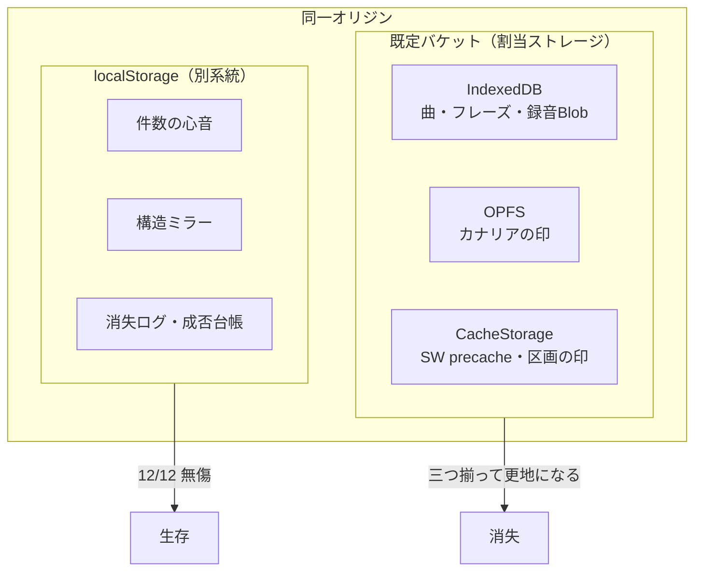

<!-- ⚠️⚠️ 出す前に必ず読め（2026-09-17 追記・この節は HTML コメントゆえ記事には出ない）

**この下書きの題と結論は、後の実測に取り下げられている。このまま出してはならぬ。**

1. 題の「空き容量が9割あっても」と、本文「## この結果が否定したもの」の
   「**容量が逼迫して追い出された ではない。逼迫度は0%です。空きは9割以上ありました**」は、
   **測り違いであった**。あれは `navigator.storage.estimate()` の **origin 単位の使用率**であって、
   **端末の空きではない**。2026-08-25 に `chrome://quota-internals` を実測したところ、
   **端末の空きは 109.47GB 中 1.58GB（1.4%）** ―― つまり端末はほぼ満杯であった。
   ⇒ utaloop の `docs/STATUS.md` は「**『容量ではない』は取り下げ**」と記している。

2. その後の実験が、逆の筋を示した。空きを 1.58GB → 6.9GB へ空けたところ、
   **2026-08-25 を最後に 21日以上ゼロ**（録音 191本＝過去の消失時の最大 96本の約2倍を失わずに保持）。
   ⚠️ ただし端末一台・空き 6.9GB での観測ゆえ断定はできぬ。言えるのは
   「この端末で、この空き具合では起きなくなった」まで。

3. 件数も古い（13回 → **実測19件**）。⑱では「23日間触れていない区画」も捨てられていた。
   守りも増えた（端末内フォルダへの控え＝区画の外に残る・ADR-054）。

**⇒ 書き直せば、記事はむしろ強くなる。** 今の筋はこうである:
   「容量ではないと思った → **それは測り違いだった** → 空けたら止まった（ただし断定はせぬ）」。
   そして他の開発者に最も効く知見は、実はここである ――
   **`navigator.storage.estimate()` の使用率を『端末の空き』と読んではならぬ。**
   正本＝utaloop `docs/design/data-loss-defenses.md` / `docs/STATUS.md` §1。
-->

スマホで歌の練習をするPWAを作っています。フレーズを区切って、お手本を繰り返し流しながら自分の声を録音して聴き比べる、という道具です。録音はすべて端末の中（IndexedDB）に置いています。

ある日、そのアプリを開いたら**録音が122本まるごと消えていました**。曲もフレーズも全部ゼロです。

一度目は事故だと思いました。二度目で疑い、三度目で腹をくくって計測の仕掛けを入れました。結果として、同じことが**13回**起きました。

その13回で分かったことと、分からなかったことを書きます。

## 消えたのはIndexedDBだけではなかった

最初の見立ては単純でした。IndexedDBが壊れたのだろう、と。

Chromiumの IndexedDB は内部でLevelDBを使っていて、不正な終了で壊れると次に開いたときに**黙って空の新品が返る**という話は知られています。実際、症状はそれで説明できました。

- 同じオリジンで、曲数が0になっている
- localStorage に置いたデータは無事
- アプリ側に「全消し」の経路はない（曲単位の削除しかない）

ところが計測の目を増やしていくと、この読みでは足りないと分かりました。

## 目を五つ置いた

推測で対策を打つ前に、**壊れた瞬間に何が起きていたかを記録する**ことにしました。置いた目は五つです。

1. **件数の心音** — 起動時とデータ変更時に「曲◯件・録音◯件」をlocalStorageへ刻む
2. **接続の終幕ログ** — `pagehide` / `freeze` でIndexedDBの接続を閉じられたか（`closed` / `skipped`）を記録
3. **OPFSカナリア** — OPFSに小さな印を書き、累積書き込み回数を引き継ぐ
4. **区画カナリア** — CacheStorage にも同じ印を書く
5. **刻みの成否台帳** — 心音を「何回書けて、いつ失敗したか」をlocalStorage側に別途記録

5番目が地味ですが決定的でした。件数がゼロになったとき、**「書けなかった」のか「書いたものが消された」のか**を区別できるようになります。

## 12回目で答えが出た

12回目（録音122本が消えた回）の診断結果です。

| 観測 | 値 |
|---|---|
| 刻みの成否台帳 | `okCount=122` / `failedAt=(none)` |
| OPFSカナリア | `LOST` |
| 区画カナリア（CacheStorage） | `LOST` |
| localStorage の生存 | **12キー中12キー** |
| ストレージ逼迫度 | **0%** |
| `navigator.storage.persisted()` | **true** |
| 接続の終幕 | `no-connection`（既に綺麗に閉じており、以後一度も開いていない） |

`failedAt=(none)` で `okCount=122` ということは、**122回きちんと書けていた**わけです。書けなかったのではなく、書いたものが消された。

そして消えたのは IndexedDB だけではありませんでした。**OPFS も CacheStorage も同時に更地**になっていて、localStorage だけが12個中12個そのまま残っていました。

つまり壊れているのは「IndexedDBという蔵」ではなく、**Chromiumの既定バケットという区画**でした。同じ区画に同居している三つが、揃って捨てられていたわけです。

## この結果が否定したもの

数字が出たことで、いくつかの見立てが消えました。

**「容量が逼迫して追い出された」ではない。** 逼迫度は0%です。空きは9割以上ありました。

**`persisted: true` は効かない。** 永続化の許可は取れていました。永続化が防ぐのは容量逼迫による追い出しであって、こういう捨てられ方は防ぎません。

**「アプリの終了処理が甘い」でもない。** 12回目を含む4回で、接続は`db.close()`まで到達して綺麗に閉じていました。その後アプリは一度もDBを開いていません。**アプリが何も触っていない時間に壊れています。**

**OPFSへ逃がす案も死にました。** これが一番痛かったところです。「IndexedDBが捨てられてもOPFSは生き残るだろう」という前提で移行を検討していたのですが、カナリアを置いて実測したら**二度とも道連れ**でした。同じ区画にある以上、逃げ場になりません。名前付きStorage Bucket（`navigator.storageBuckets`）も同じquota層の下なので、期待は薄いと判断しました。

## 13回目で再現しました

一件だけだと偶然かもしれないので、次を待ちました。5日後に来ました。

署名は寸分違いませんでした。`okCount=167` / `failedAt=(none)`、OPFSも区画カナリアも `LOST`、逼迫0%、`persisted: true`、`no-connection`。

違ったのは沈黙の長さです。最後に接続が閉じたのが7月31日の21時すぎ、発見が8月2日の16時半。**約43時間、アプリは一度も起動していません。** その間に消えていました。

## 分かっていないこと

正直に書くと、**引き金は特定できていません。**

Chromiumのquota/bucket層が自分で捨てているのか、端末側の掃除機能なのか、あるいはオリジン固有の何かなのか。この3つを分ける材料がまだありません。

気になっているのは、**13回すべてが同じオリジンで起きている**ことです。開発中はTailscale経由のHTTPSオリジン（`***.ts.net:8443`）で実機に配信していました。そこで13回。

なので稽古場をVercelの本番オリジンへ移して様子を見ています。11日経った時点で0回です。オリジン固有の癖という線が濃くなってきましたが、13回目は43時間の沈黙のあとに来たので、**11日の無事はまだ証拠になりません**。間隔の内側にいるだけかもしれないので、そのまま待っています。

あと、これはPixel 9a / Chromium系での話です。iOSや他のAndroidで同じことが起きるかは分かりません。

## 結局どうしたか

区画の外に出すしかない、という結論になりました。具体的にはzipエクスポートです。

ただ、機能としてのzipエクスポートは最初から実装してありました。**122本が消えたとき、その機能は動く状態でありながら一度も押されていなかった**わけです。

診断ログを見返して気づいたのは、こうです。zipが組めなかったのではありません。**自分がどれだけ無防備なのかを知る手段がなかった**のです。「最後にバックアップした日時」はIndexedDBの中に書いていたので、区画と一緒に消えます。画面のどこにも「未バックアップ◯本」とは出ていませんでした。

対策は3つです。

- バックアップ日時を**localStorage側にも二重に書く**（読むときは古い方を採用。削除の可否を判断する値なので、食い違ったら安全側へ倒す）
- **「未バックアップ◯本・最後から◯日」を常に見える場所に出す**（未バックアップが0なら何も出さない。常に鳴っている警告は壁紙になるので）
- その表示から**1タップで既存のエクスポートを叩く**（新しい仕組みは作らない）

差分バックアップと自動バックアップは見送りました。差分は連鎖の1本が欠けた時点で復元が壊れるので、**区画ごと消える病に対して一番弱い形**になります。全量方式なら「最新の1本以外は捨ててよい」が成り立つので、そちらを選びました。

## 教訓のようなもの

3つ書いておきます。

**推測で大工事を始める前に、目を置いたほうが安いです。** OPFSへの全面移行は数日仕事になるところでしたが、カナリア（数十行）を先に置いたおかげで、着手する前に前提が偽だと分かりました。

**「壊れた」と「書けなかった」を区別できる記録を持つと、話が一気に進みます。** 成否台帳を入れるまでは、原因の候補が絞れずに堂々巡りでした。

**永続化ストレージの保証範囲を実際より広く見積もっていました。** `persisted: true` が取れていれば安心だと思っていたのですが、防いでくれるのは容量逼迫による追い出しだけです。ブラウザのローカルストレージに置いたユーザーデータは、**いつか消える前提で設計する**しかないと今は思っています。

---

このアプリは[うたループ](https://maruhuku.jp/products/utaloop/)という名前で公開しています。消失の件はプロダクトページにも書いてあります。隠して使ってもらっても、消えた日にいなくなるだけなので。
