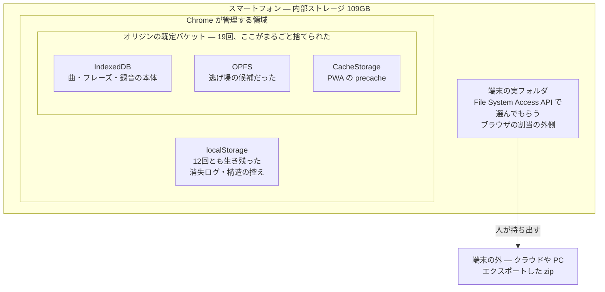
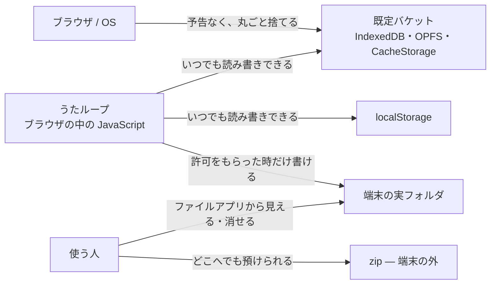

歌の練習用PWAを個人で作っています。録音した自分の歌を IndexedDB に保存するアプリです。

そのIndexedDBが、**2026年7月11日から8月26日までのあいだに19回、中身ごと消えました。** 曲もフレーズも録音も、全部ゼロになります。最も多いときで録音122本が一度に消えました。

原因を追いかけて、途中で一度**大きな読み違いをしていた**ことが分かりました。この記事はその記録です。結論から言うと、いちばん他の人の役に立ちそうな知見は、真因の話ではなくて、**私が二ヶ月近く間違えて読んでいた API の話**です。

## 消えたのは IndexedDB だけではなかった

最初は「IndexedDBが壊れたのだろう」と思っていました。接続の切り方が悪いのか、書き込み中に落ちているのか。

そこで、消えたときに何が起きていたのかを後から読めるように、**目を五つ**置きました。

| 置いた目 | 何が分かるか |
|---|---|
| 構造ミラー（localStorage） | 曲とフレーズの控え。消えても構造だけは戻せる |
| 消失ログ（localStorage） | 何がいくつからゼロになったか、いつか、どの版か |
| セッションの終幕記録 | 前回アプリがどう閉じたか（きれいに閉じたか、凍結されたか） |
| **OPFS カナリア** | OPFS に置いた印。生きていれば OPFS は無事 |
| **区画カナリア**（CacheStorage） | CacheStorage に置いた印。同上 |

加えて、印を**刻めたかどうか**の台帳も取りました。「刻めずに終わった夜」と「刻んだのに消された夜」を区別できないと、何も証明できないからです。

12回目の消失で、答えが出ました。

```
IndexedDB        → 空
OPFS カナリア     → LOST（領域は開けたが印が無い）
区画カナリア      → LOST（同上）
localStorage     → 生きている
刻みの成否        → failedAt=(none)（刻めなかったのではない）
persisted        → true
```

**IndexedDB・OPFS・CacheStorage が揃って更地になり、別系統の localStorage だけが生き残っていました。** しかも印は「刻めなかった」のではなく「刻んだものが消された」。

つまり壊れているのは蔵（IndexedDB）ひとつではありません。**このオリジンに割り当てられたストレージが、区画ごと捨てられている。** Chromium でいう「既定バケット」がまるごと消えている、という理解になりました。

:::message
**用語：オリジン、バケットと「既定バケット」**

まず**オリジン**から。ドメインに似ていますが、もう少し厳しい単位です。**スキームとホストとポートの三つ組**で、
三つとも一致して初めて「同じオリジン」になります。

| | 同じオリジンか |
|---|---|
| `https://example.com` と `http://example.com` | **別**（スキームが違う） |
| `https://example.com` と `https://app.example.com` | **別**（ホストが違う） |
| `https://example.com` と `https://example.com:8443` | **別**（ポートが違う） |

**ブラウザの保存領域は、このオリジンごとに完全に分かれています。** 別のオリジンなら、棚も、バケットも、
localStorage も、まるごと別物です。

これは私の調査でも効きました。途中で置き場所を自宅サーバ（`…ts.net:8443`）から Vercel
（`utaloop.vercel.app`）へ移したのですが、**消失ログも別々に積まれます**。移した先の記録だけを見て
「静かになった」と思っていたら、**古い方の蔵に7日間読まれないまま1件積まれていた**、ということがありました。

さて、バケットの話です。Storage Standard では、ブラウザはオリジンごとに**棚**を持ち、その棚に**バケット**が並ぶ、と定めています。
何もしなければバケットは**一つだけ**で、それが**既定バケット**です。

**IndexedDB・CacheStorage・OPFS は、それぞれ独立した保管庫ではありません。** どれも
「既定バケットの中の一区画」として置かれています。つまり構造はこうです。

```
オリジン（https://example.com）
  └ 既定バケット          ← 容量の割当・永続性・退去の判定は、この単位で行われる
      ├ IndexedDB
      ├ CacheStorage
      └ OPFS
```

**退去（eviction）も削除も、この箱の単位で起きます。** 中身を一つだけ選んで捨てる仕組みではありません。
だから「IndexedDB が危ないので OPFS へ」は、同じ箱の中での引っ越しにしかなりません。

補足を三つ。

- **`navigator.storage.persist()`** で `persisted: true` を取ると、この既定バケットが persistent になります。
  ただし仕様上これが守るのは**容量逼迫による自動退去**からであって、あらゆる消え方を防ぐものではありません
  （実際、私の19回はすべて `persisted: true` の状態で起きています）。
- **Storage Buckets API**（`navigator.storageBuckets.open()`）を使えば、名前付きのバケットを追加で作れます。
  バケットごとに永続性や期限を分けられるのですが、**同じ quota の層の下にある**ので、
  「別のバケットへ逃がせば助かる」とは考えにくく、私は採りませんでした。
- **localStorage** は、仕様の上では同じ棚の住人として書かれています。けれど Chromium の実装では
  別系統の保存庫に置かれており、名前付きバケットへ分割することもできません。
  **私の19回で localStorage だけが生き残ったのは、この実装上の分離とよく符合します**
  ―― ただし、仕様がそれを保証しているわけではありません。

実機で中を覗きたいときは `chrome://quota-internals` を開くと、バケットの一覧と最終更新が見られます。
:::

この署名は、以後の消失でも寸分違いませんでした。localStorage は全期間を通じて12回とも生き残っています。

## 端末の中のどこに、何が在るのか

言葉だけだと分かりにくいので、図にします。まず**位置**です。



**IndexedDB・OPFS・CacheStorage は、同じ一つの箱の中の住人です。** だから「IndexedDB が危ないので OPFS へ逃がそう」は成立しません。箱ごと捨てられるからです。

`localStorage` は Chrome の管理下にありますが、**実測では19回とも道連れになりませんでした**（仕様がそう保証しているわけではなく、あくまで私の端末で観測された振る舞いです）。だから消失ログと構造の控えはそこに置いています ―― **消えた側に記録を置いても、記録ごと消えるので。**

次に、**誰が触れるのか**です。



表にすると、こうなります。

| 置き場所 | アプリから | 使う人から | ブラウザ / OS から |
|---|---|---|---|
| 既定バケット（IndexedDB ほか） | いつでも読み書き | 見えない | **予告なく丸ごと捨てられる** |
| localStorage | いつでも読み書き | 見えない | 実測では捨てられなかった |
| 端末の実フォルダ | **許可をもらった時だけ**書ける | ファイルアプリで見える | 捨てない |
| zip（端末の外） | 書き出すだけ | 自由に扱える | 関与しない |

ここで効いてくるのが**右の二列**です。バケットの中身は、消えるまで**誰の目にも触れません**。使う人は自分の録音がどこにあるのか見えないし、消えたことにも気づけない。**フォルダへ出した瞬間に、初めて「自分で扱えるもの」になります。**

サーバはありません。ログインもありません。**録音は一度も端末の外へ出ません** ―― それがこのアプリの売りなのですが、裏を返すと**消えたら誰にも復元できない**ということでもあります。

## これで消えた見立て

数字が出たことで、いくつかの仮説が死にました。

**`persisted: true` は効きません。** 永続化の許可は毎回取れていました。永続化が防ぐのは容量逼迫による追い出しであって、この捨てられ方は防いでくれませんでした。

**アプリの終了処理が甘いのでもありません。** 何度かは、前回のセッションが `db.close()` まで到達して綺麗に閉じていました（`clean-close`）。その後アプリは一度もDBを開いていません。**誰も触っていない時間に更地になっています。**

**OPFS へ逃がす案も死にました。** これが一番痛かったところです。「IndexedDBが捨てられても OPFS は生き残るだろう」という前提で移行を検討していたのですが、カナリアを置いて実測したら**二度とも道連れ**でした。同じ区画にある以上、逃げ場になりません。名前付き Storage Bucket も同じ層の下なので、期待は薄いと判断しました。

**「バージョン更新のときに壊れる」でもありませんでした。** 消失の多くは新しいビルドを掴んだ直後に見つかるので、最初は更新が引き金だと思っていました。でも逆です ―― 区画が捨てられればキャッシュ（precache）も道連れになるので、次の起動は必ず新しい版を取りに行きます。**更新跨ぎは病の影であって、病ではありませんでした。** 実際、版が変わっていない状態で消えた回も複数あります。

**オリジン固有でもありませんでした。** 自宅サーバ（Tailscale 経由）で動かしていたものを Vercel に移して様子を見ましたが、**移した先でも同じ署名で3回消えました。**

さらに、**23日間ただの一度も開いていない**オリジンの蔵を検分したら、そちらも消えていました。「使っているから捨てられる」でもないわけです。

## そして、私は一つ読み違えていました

ここからが本題です。

上の調査のあいだ、私はずっと診断情報にこう書いていました。

```
pressure: usage=0MB quota=10240MB (0%)
```

**「ストレージ逼迫度 0%」。空きは十分にある。だから容量の問題ではない。** ―― 17件ぶんの記録に、私はそう書き続けていました。

これが間違いでした。

この数字は `navigator.storage.estimate()` の `usage` と `quota` です。そして **`quota` は端末の空き容量ではありません。** あれは「このオリジンが使ってよい上限」であって、Chromium が計算して割り当てた数字です。**端末そのものの空きとは別の物差しなのに、私はそれを端末の空きだと思って読んでいました。**

8月25日、`chrome://quota-internals` を実機で開いて、初めて本当の数字を見ました。

```
端末の総容量 : 109.47 GB
端末の空き   : 1.58 GB（1.4%）
```

**端末はほぼ満杯でした。** 「空きは9割以上ある」どころか、残り1.4%です。

Web の API からは端末の空き容量は読めません。だから診断パネルにも出せず、私は代わりに読める数字（オリジン単位の使用率）を見て、**読めない数字を見た気になっていました。**

## 空けてみたら、止まりました

そこで実験をしました。**端末の空きを 1.58GB から 7GB 程度まで空けて、消失が続くかどうかを見る。**

結果です（2026年9月17日時点）。

| | 空ける前 | 空けたあと |
|---|---|---|
| 消失の間隔 | 12日 → 7日 → 3日16時間 → **16時間** と加速していた | **3週間以上ゼロ** |
| 抱えている録音 | 消失時の最大が96本 | **191本**を一度も失わずに保持 |
| 区画カナリア | 毎回 `LOST` | 400回以上の書き込みを生き延びている |

間隔が16時間まで縮んでいたところからの3週間なので、偶然にしては長い沈黙です。

**ただし、これを「原因が分かった」と書くつもりはありません。**

空けたといっても 6.9GB で、109GB の端末の 6.3% にすぎません。目安にしていた 20〜30GB には遠く届いていない。言えるのは「**この端末で、この空き具合では起きなくなった**」までです。端末は1台、観測者も私一人です。

それでも、**「容量ではない」と17件ぶん書き続けた記述は取り下げました。** 少なくともその主張には根拠がありませんでした。

## 結局どう設計したか

原因の断定はできていませんが、設計の結論は先に出ています。

**区画ごと捨てられるのなら、逃げ場は区画の外にしかありません。** IndexedDB も OPFS も CacheStorage も同じ区画の住人なので（上の図の内側の箱です）、その中でいくら引っ越しても意味がない。そこで二段構えにしました。

1. **端末内の実フォルダへ控える**（File System Access API）。置き場所を一度選んでもらえば、録音のたびにフォルダへも書きます。ここはブラウザの割当ストレージの外なので、区画が捨てられても残ります。
2. **zip で端末の外へ書き出す**。機種変更や端末そのものを失う備えです。

そのうえで、**「まだ外へ出していない録音が何本あるか」を常に画面に出す**ことにしました。19回の消失を振り返ると、失われた録音の多くは「退避できなかった」のではなく「**退避されないままだった**」からです。組めたはずの退避が組まれなかった。アプリがそれを誰にも告げていなかったのが、いちばんの設計の失敗でした。

## 持ち帰ってもらえるとしたら

**`navigator.storage.estimate()` の `quota` を端末の空き容量として読まないでください。** あれはオリジンへの割当であって、端末の残量ではありません。混同すると、私のように「容量は十分だ」という誤った前提の上に調査を積み上げることになります。端末の空きを知りたいときは、Web の API では届きません（開発中なら `chrome://quota-internals` で見られます）。

**`persisted: true` は「消えない」ではありません。** 防いでくれるのは容量逼迫による追い出しだけで、区画ごと捨てられる場合には効きませんでした。

**OPFS は IndexedDB のバックアップ先になりません。** 同じ区画にあるので一緒に消えます。逃がすなら区画の外へ。

**そして、ブラウザに置いたユーザーデータは、いつか消える前提で設計するしかない**と今は思っています。消えないようにする努力より、**消えたときに何が失われるかをユーザーに見せておく**ほうが、結果的にデータを守ってくれました。

---

このアプリは[うたループ](https://maruhuku.jp/products/utaloop/)という名前で公開しています。消失の件はプロダクトページにも書いています。隠して使ってもらっても、消えた日にいなくなるだけなので。
