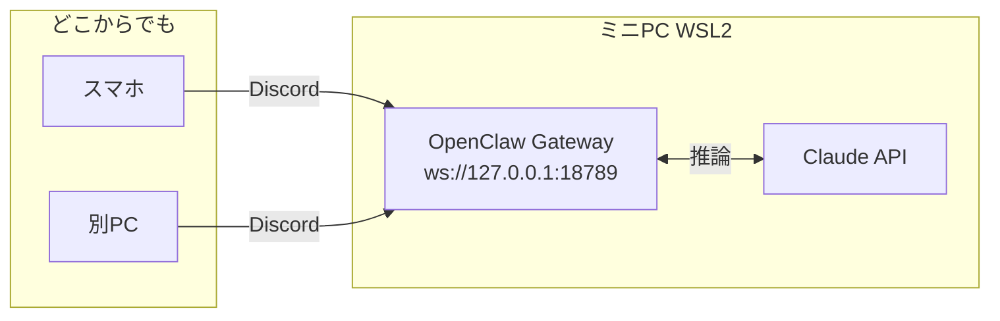

Zennの作者であるcatnose氏がXで、自分のClaude Code環境を紹介していました。構成はClaude Code + 自作メモリ + SSHで、OpenClawは使っていないとのこと。

自分はOpenClawをWSL2のミニPC上で動かしてDiscordから使っています。「同じ目的に対してこういう構成もあるのか」と思い、比較しながら考えてみました。

## catnose氏の構成

- **Claude Code**: Anthropic公式CLIをそのまま使う
- **SSH**: 外部からリモートマシンにSSH接続してClaude Codeを実行
- **自作メモリ**: セッション間でコンテキストを維持する独自の仕組み

SSHで繋いでClaude Codeを起動するだけなので、ゲートウェイやBot設定が不要です。

## 自分のOpenClaw構成と比べる

自分の構成はこうなっています。

ミニPCのWSL2でOpenClaw Gatewayを常駐させて、Discordからメンションを送るとClaudeが応答します。スマホのDiscordアプリから使えるのが目的です。セットアップの詳細は[こちらの記事](https://zenn.dev/imudak/articles/openclaw-wsl-discord)に書きました。

| 項目 | catnose氏の構成 | 自分のOpenClaw |
|------|----------------|---------------|
| アクセス | SSHクライアント | Discordアプリ |
| 常駐プロセス | 不要 | Gateway必要 |
| セットアップ | シンプル | 複雑 |
| モバイル | SSHアプリ | Discordアプリ |
| メモリ管理 | 自作ファイル | 会話履歴 |

### 中間層がない

一番大きな違いは、**中間層がない**ことです。

OpenClawはDiscordとAIの間に立つ仲介者です。便利ですが、障害点も増えます。実際、OpenClawを使い続けていると問題が出てきます。セキュリティ更新でGatewayが停止したり（[参考](https://zenn.dev/imudak/articles/openclaw-security-hardening-2026)）、Browser Relay設定を変えてDiscord接続が切れたり（[参考](https://zenn.dev/imudak/articles/openclaw-browser-relay-trouble)）します。

Claude Code + SSHなら、これらは原理的に起きません。Claude APIが動いていれば使えます。

### 自作メモリが気になった

「自作メモリ」という部分が特に気になりました。Claude Codeはセッションをまたいで記憶しません。毎回ゼロからのスタートです。

Claude Codeには `CLAUDE.md` という仕組みがあります。プロジェクトやユーザー固有の指示を書いておくと、毎回のセッションで読み込まれます。これを発展させて、会話で得た情報や進行中のタスクの状態をファイルとして保持しておく仕組みを作っているのだと考えられます。

自分の環境でも `CLAUDE.md` は使っていますが、セッション間でメモリを動的に更新する仕組みはありませんでした。OpenClawの会話履歴がある程度メモリ代わりになっていたからです。ただ、Discordのチャンネル履歴を「メモリ」として扱うのは構造上無理があります。Claude Codeが直接参照できるフォーマットではないので。

## すぐに乗り換えるつもりはないが

スマホのDiscordから気軽に話しかけられるのは便利で、この使い勝手を変えるほどの理由が今のところありません。

ただ、メモリ管理の部分は参考にしたいと思いました。OpenClawを使い続けるにしても、セッション間のコンテキスト管理は改善できます。OpenClawで動かしているClaude Codeのメモリファイルを整備して、「次のセッションでも引き継ぎたいこと」を記録する仕組みを作るのは、OpenClaw側の変更なしにできます。

## まとめ

catnose氏の構成から気づいたのは、「常駐してチャットアプリから使う」という機能と「セッションをまたいでコンテキストを保持する」という機能は、別の問題として切り離せるということです。

同じ目的（どこからでもAIを使う）に対して、構成の選択肢は複数あります。OpenClawのセットアップコストやメンテナンスコストを避けたいなら、Claude Code + SSH + 自作メモリというシンプルな構成は合理的な選択肢だと思います。SSH接続できる環境があれば始められます。

自分の場合はOpenClawのDiscord連携を手放す理由がないので構成は変えませんが、メモリ管理の仕組みは取り込もうと思っています。
