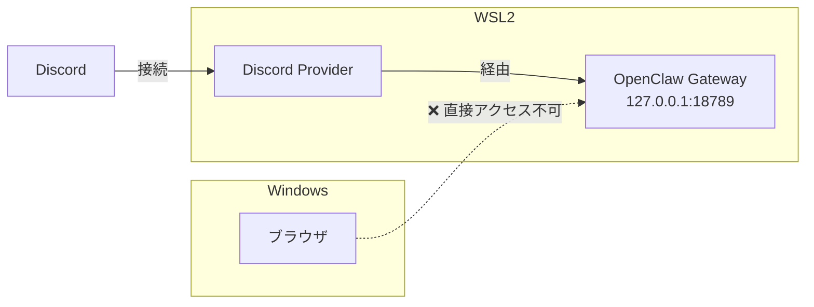

## はじめに

OpenClawにはブラウザからControl UIを操作できる**Browser Relay**という機能があります。

使えるのは知っていたのですが、WSL2上で動かしているためWindowsのブラウザから直接アクセスできない状態でした。「そろそろ設定してみよう」と思い、いくつかの変更を加えたところ——Discordとの接続が切れました。

復旧できたので、原因と対処、それからBrowser Relayへのアクセス方法の選択肢をまとめておきます。

## 環境

- OS: Windows 11 Pro + WSL2 (Ubuntu 24.04)
- OpenClaw: v2026.2.21-2
- ゲートウェイ: `ws://127.0.0.1:18789`（WSL内loopback）でリスン中
- Discord連携: `@Lord Claw` として稼働中

## やったこと

ゲートウェイをWSL外部から見えるようにしようと、2つの変更を加えました。

### 変更1: `gateway.bind` を `"all"` に設定

`~/.openclaw/openclaw.json` の `gateway` セクションに `"bind": "all"` を追加しました。

```json
"gateway": {
    "port": 18789,
    "mode": "local",
    "bind": "all"
}
```

### 変更2: Windowsのnetshでポートフォワーディングを追加

WSLのIPアドレスを調べて、Windows側からアクセスできるようポートプロキシを設定しました。

```powershell
netsh interface portproxy add v4tov4 `
  listenport=18792 listenaddress=0.0.0.0 `
  connectport=18792 connectaddress=172.27.204.237
```

この2つの変更後、Discordからの応答がなくなりました。

## 何が起きていたか

`openclaw status` を実行すると原因がわかりました。

```text
gateway.bind: Invalid input
```

`gateway.bind` に `"all"` は無効な設定値でした。

OpenClaw v2026.2.21-2では `gateway.bind` の有効な値として `"all"` は認識されません。設定バリデーションエラーが発生し、ゲートウェイが起動しない状態になっていました。

ゲートウェイが停止すると、Discord連携もゲートウェイ経由で動作するため、そのまま接続が切れます。

### netshの変更は関係あったか

直接の原因ではありませんでした。

netshのポートプロキシ（ポート18792）はゲートウェイ（ポート18789）とは別ポートで、そもそも対象が違います。2つの変更を同時に行ったため原因の切り分けが難しくなりましたが、問題の本質は `gateway.bind` の不正値でした。

## 復旧手順

### 1. 設定ファイルを直接編集する

設定バリデーションエラーが発生している状態では `openclaw config set` 等のCLIコマンドも動作しなくなります。`~/.openclaw/openclaw.json` を直接編集して `gateway.bind` キーを削除しました。

削除前の状態です。

```json
"gateway": {
    "port": 18789,
    "mode": "local",
    "bind": "all"
}
```

削除後の状態です。

```json
"gateway": {
    "port": 18789,
    "mode": "local"
}
```

### 2. ゲートウェイを再起動する

```bash
openclaw gateway restart
```

Discordへの再接続を確認して復旧完了です。

なお `openclaw doctor --fix` も試しましたが、config修正は行いませんでした。設定ファイルの問題は手動対応が必要です。

## Browser RelayをWindowsから使う選択肢

### 現状の構成



WSL2のloopbackでのみリスンしているため、Windowsのブラウザから直接到達できません。

### 案1: SSHポートフォワーディング（最も手軽）

WindowsからWSLへのSSHトンネルを使います。

```powershell
# PowerShellから実行
ssh -L 18789:127.0.0.1:18789 imudak@localhost
```

SSHセッションを張っている間、Windowsのブラウザから `http://127.0.0.1:18789/` でアクセスできます。

追加ソフト不要で、ゲートウェイの設定変更も不要です。常時アクセスが必要でなければこれが一番手軽です。

### 案2: Tailscale（長期運用向け）

OpenClawにはTailscale統合が組み込まれています。

```json
"gateway": {
    "port": 18789,
    "mode": "local",
    "tailscale": {
        "mode": "on",
        "resetOnExit": false
    }
}
```

WSLとWindowsの両方をTailnetに参加させると、Tailscale IPでゲートウェイにアクセスできます。外出先からもアクセスできる点はSSHフォワーディングにない利点です。

### 案3: netsh + 正しいbind設定値

`gateway.bind` の正しい設定値を調べた上で全インターフェースにバインドし、Windowsからnetshのportproxyでアクセスする方法です。今回 `"all"` が無効だったため、OpenClawのドキュメントか `openclaw configure` ウィザードで正しい値を確認する必要があります。

WSLのIPはWSL再起動で変わるため、都度更新が必要です。

### 案4: リバースプロキシ

WSL内でnginxやCaddyを立てる方法です。細かいアクセス制御が可能ですが、単にBrowser Relayを使いたいだけであればオーバーキルだと思いました。

## まとめ

| 案 | 難易度 | 常時アクセス | 追加設定 |
|----|--------|-------------|---------|
| SSHポートフォワーディング | 低 | ❌（セッション維持必要） | なし |
| Tailscale | 中 | ✅ | Tailnetへの参加 |
| netsh + 正しいbind値 | 中 | ✅ | 設定値調査が必要 |
| リバースプロキシ | 高 | ✅ | nginx等の設定 |

設定変更は1つずつ行い、変更後に `openclaw status` でエラーが出ていないことを確認してから次に進めばよかったと思います。2つの変更を同時に加えたことで原因の切り分けに手間がかかりました。

当面はSSHフォワーディングで様子を見て、常時アクセスが必要になったらTailscaleを検討するつもりです。

## 関連記事

- [OpenClawのセキュリティ強化](https://zenn.dev/imudak/articles/openclaw-security-hardening-2026)
- [OpenClawのアップデートで応答不能に](https://zenn.dev/imudak/articles/openclaw-update-trouble-recovery)
- [OpenClawのClaude Codeが無言で死ぬ](https://zenn.dev/imudak/articles/openclaw-pairing-scope-investigation)
