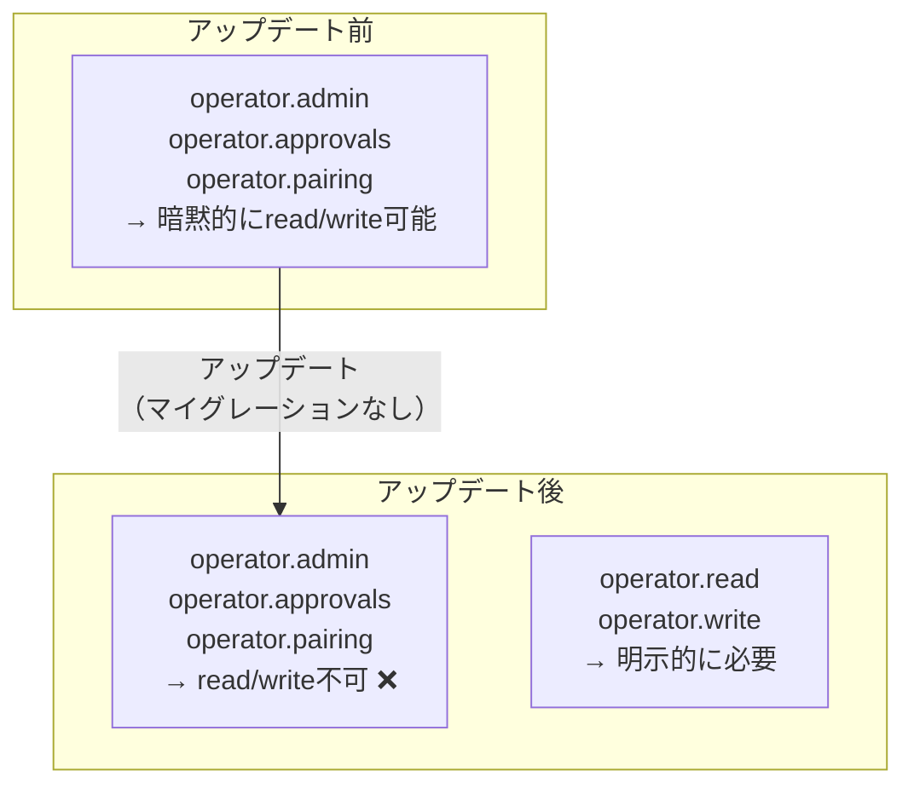
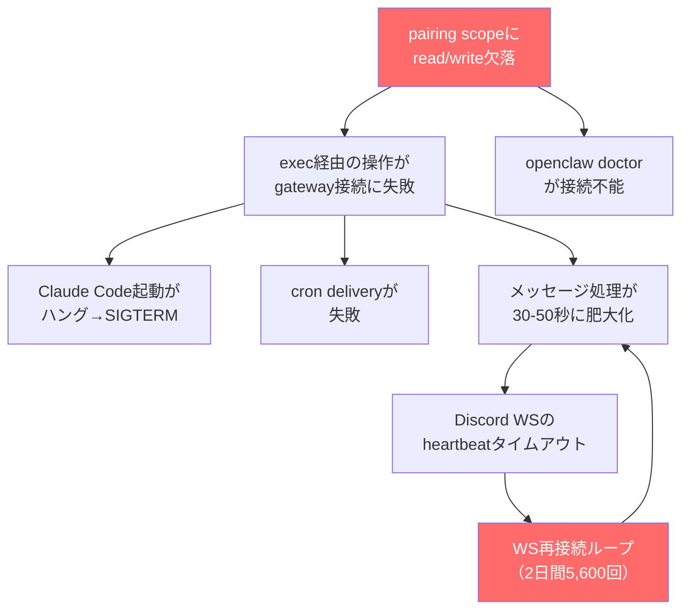

## はじめに

AIエージェント（OpenClaw）経由でClaude Codeを起動すると、出力が一切なく、10〜15分後にSIGTERMで終了する——という症状が出ていました。

Claude Code自体は正常に動きます。ターミナルから直接叩けば問題なし。OpenClawのexecツール経由でだけ壊れます。

調査してみたら、**Discord WebSocketが2日間で5,600回以上の再接続ループ**を起こしていて、その原因がセキュリティアップデートによるpairing権限の欠落でした。

この記事は、前回のセキュリティ強化記事の「後日談」にあたります。セキュリティ対策自体は正しかったのですが、そのアップデートが別の壊れ方を引き起こしていた、という話です。

https://zenn.dev/imudak/articles/openclaw-security-hardening-2026

## 環境

- OS: Windows 11 Pro + WSL2 (Ubuntu 24.04)
- Node.js: v24.13.0（nvm経由）
- OpenClaw: 2026.2.19-2
- Claude Code: 2.1.49

## 症状

### 1. Claude Codeが無言で死ぬ

OpenClawからClaude Codeを起動すると：

```
# OpenClawのexec経由（壊れる）
exec: claude --dangerously-skip-permissions -p "..." --model sonnet
→ process log: (no output yet)
→ 10〜15分後: SIGTERM

# 直接実行（正常）
$ cd ~/projects/flow-manager
$ claude --dangerously-skip-permissions -p "echo hello" --output-format text
→ hello
```

出力ゼロでSIGTERMという症状は、プロセス自体が起動していないか、gatewayとの通信で詰まっているかのどちらかです。

### 2. Discord経由の応答が異様に遅い

Discordでメンションしてから返答が来るまで30秒以上かかることがありました。ただ、常にではなく、速いときは速い。不安定だが致命的ではない——という微妙な壊れ方です。

### 3. cronジョブが「delivery failed」

定期実行のcronジョブが `cron announce delivery failed` エラーで失敗していました。実行自体は成功するのに、結果をDiscordに送れない。

## 調査

### journalctlで見えたもの

```bash
journalctl --user -u openclaw-gateway --no-pager -n 50
```

```
[discord] gateway: Attempting resume with backoff: 1000ms
[discord] gateway: WebSocket connection closed with code 1005
[discord] gateway: Attempting resume with backoff: 1000ms
[discord] gateway: WebSocket connection closed with code 1005
（以下、延々と繰り返し）
```

**Discord WebSocketが再接続ループ**に陥っていました。接続→即切断→再接続→即切断。これが2日間で5,600回以上。

さらに：

```
[discord] Slow listener detected: DiscordMessageListener took 50.2 seconds
for event MESSAGE_CREATE
```

メッセージ処理に50秒。Discord WebSocketのheartbeat間隔は約41秒なので、メッセージ処理中にheartbeatが送れず、Discordサーバー側からタイムアウト切断されています。

### scope-upgradeの失敗

```
[gateway] security audit: device access upgrade requested
  reason=scope-upgrade
  scopesFrom=operator.admin,operator.approvals,operator.pairing
  scopesTo=operator.write
  ...
[ws] closed before connect code=1008 reason=connect failed
```

CLIがgatewayに`operator.write`権限を要求して、**拒否されている**。

### openclaw doctorで確定

```bash
$ openclaw doctor
gateway connect failed: Error: pairing required
```

doctorコマンド自体がgatewayに接続できない。

## 原因

`~/.openclaw/devices/paired.json`を見ると：

```json
{
  "1e4e9cbf...": {
    "role": "operator",
    "scopes": [
      "operator.admin",
      "operator.approvals",
      "operator.pairing"
    ]
  }
}
```

**`operator.read`と`operator.write`がない。**

OpenClawのセキュリティ強化アップデートでスコープモデルが変わり、read/writeが独立したスコープとして必要になりました。しかし、既存デバイスのスコープは自動マイグレーションされていませんでした。



### 影響の連鎖



1つの権限欠落が、Claude Codeの無応答、Discord WSの再接続ループ、cron配信失敗、応答遅延——すべてに波及していました。

## 修復

### paired.jsonの直接編集

```python
import json

path = '/home/username/.openclaw/devices/paired.json'
with open(path) as f:
    data = json.load(f)

device_id = 'your_device_id_here'  # CLIデバイスのID
scopes = [
    'operator.admin',
    'operator.approvals', 
    'operator.pairing',
    'operator.read',     # 追加
    'operator.write'     # 追加
]
data[device_id]['scopes'] = scopes
data[device_id]['tokens']['operator']['scopes'] = scopes

with open(path, 'w') as f:
    json.dump(data, f, indent=2)
```

### pendingリクエストのクリア

```python
with open('/home/username/.openclaw/devices/pending.json', 'w') as f:
    json.dump({}, f)
```

### gateway再起動

```bash
openclaw gateway restart
```

### 確認

```bash
# pairing errorが消えたことを確認
$ openclaw doctor
# → "pairing required" が出なくなれば成功

# WS再接続が止まったことを確認
$ journalctl --user -u openclaw-gateway --since "1 minute ago" | grep -c "WebSocket connection closed"
# → 0
```

## 前回との関係

前回のセキュリティ強化記事では、`gateway.bind`を`loopback`に変更し、auth tokenが設定されていることを確認しました。これ自体は正しい対応でした。

しかし、同じアップデートがスコープモデルも変更していて、その影響は**すぐには表面化しませんでした**。Discord経由のチャットは動く、Heartbeatも動く、でもexec経由の操作だけ壊れる——という部分的な故障だったため、気づくのに時間がかかりました。

| 前回の記事 | 今回の記事 |
|-----------|-----------|
| `ws://` non-loopback接続のブロック | pairing scopeの欠落 |
| すぐエラーメッセージが出た | 2日間気づかなかった |
| 設定変更で修復 | paired.json直接編集で修復 |
| セキュリティ対策として正しい | セキュリティ対策の副作用 |

## 教訓

### 1. 部分的に壊れるのが一番怖い

完全に動かなくなれば即座に気づきます。でもDiscordのチャットは動く、cronの一部は成功する、Claude Codeだけが壊れる——こういう部分的な故障は発見が遅れます。

### 2. アップデート後は`openclaw doctor`

毎回やるべきです。今回もdoctorを実行していれば`pairing required`エラーで即座に気づけました。自動更新cronにdoctorチェックを組み込むことにしました。

### 3. ログは嘘をつかない

journalctlを見れば5,600回の再接続ループが一目瞭然でした。体感的に「なんか遅いな」「Claude Codeが不安定だな」と思っていた期間、裏ではこれが起きていた。ログを見る習慣の重要さを再認識しました。

### 4. セキュリティ強化は壊れ方も変える

セキュリティアップデートは「攻撃を防ぐ」だけでなく、「正規の操作も巻き込む」可能性があります。特に権限モデルの変更は、既存の設定との互換性を壊しやすいです。

## まとめ

| 項目 | 内容 |
|------|------|
| 症状 | Claude Code無応答、Discord遅延、cron配信失敗 |
| 根本原因 | pairing scopeに`operator.read`/`operator.write`欠落 |
| 発生契機 | セキュリティ強化アップデート（スコープモデル変更） |
| 影響期間 | 約2日間 |
| 修復方法 | `paired.json`にスコープ追加 → gateway再起動 |
| 予防策 | アップデート後に`openclaw doctor`を実行 |

OpenClawを自動更新している方は、更新後に`openclaw doctor`が通ることを確認するステップを入れることをお勧めします。

## 関連記事

https://zenn.dev/imudak/articles/openclaw-security-hardening-2026

https://zenn.dev/imudak/articles/openclaw-update-trouble-recovery

https://zenn.dev/imudak/articles/openclaw-wsl-discord
