## はじめに

AIエージェントに「自分自身を更新して」と頼んだら、更新はできたものの、その直後からDiscordにセキュリティエラーの警告が流れてきました。エージェント自身がgatewayにアクセスできなくなっていたようなのですが、CLIの内部動作なので手元からは何が起きているのかわかりません。

ただ、最近OpenClaw周辺でセキュリティ問題が話題になっていたのは知っていたので、そのあたりが関係していそうだと見当をつけて調べてもらいました。結果的に、かなり大きな話につながったのでまとめておきます。

## OpenClawの構成をざっくり理解する

まず前提として、OpenClawの構成を簡単に説明します。

```mermaid
graph LR
    subgraph "チャットアプリ"
        Discord
        Telegram
        Slack
    end

    subgraph "自分のマシン"
        GW["Gateway<br/>:18789"]
        AI["AI<br/>(Claude等)"]
        CLI["CLI<br/>openclaw コマンド"]
        Cron["Cronジョブ"]
    end

    Discord <-->|メッセージ| GW
    Telegram <-->|メッセージ| GW
    Slack <-->|メッセージ| GW
    GW <-->|推論| AI
    CLI -->|WebSocket| GW
    Cron -->|WebSocket| GW
```



**Gateway**がすべての中心です。チャットアプリからのメッセージを受け取り、AIに渡し、結果を返します。CLIやcronジョブもWebSocket経由でgatewayに接続して動きます。

## 更新したら動かなくなった

### 状況

自分のOpenClawはWSL2上でsystemdサービスとして動いています。gatewayのbind設定は`tailnet`にしていました。Tailscale（VPN）経由で複数端末からアクセスできるようにするためです。


### 何が起きたか

v2026.2.19-2への更新自体は成功しました。ところがその直後、Discordにこんなエラーが流れてきます。

```
SECURITY ERROR: Gateway URL "ws://100.122.114.36:18789"
uses plaintext ws:// to a non-loopback address.
Both credentials and chat data would be exposed to network interception.
```


エージェントがgatewayの操作（cron編集など）をしようとするたびにセキュリティエラーで弾かれている状態でした。Discord経由のチャットは動いているので会話はできるのですが、内部のツール呼び出しが壊れています。

### 対応

原因はわかりやすくて、`ws://`（暗号化なし）でloopback以外のアドレスに接続することが、新バージョンのセキュリティチェックでブロックされていました。

外部からgatewayに直接接続する必要はなかったので、`loopback`に変更しました。

```bash
openclaw config set gateway.bind loopback
openclaw gateway restart
```


これで復旧しました。SSH経由での作業やWebアプリ（別ポート）には影響ありません。gatewayポート（18789）だけの話です。

## 調べてみたら、もっと大きな話だった

動かなくなった原因は単純でしたが、なぜこんなに急にセキュリティが厳しくなったのか気になって調べてみたところ、2026年2月のOpenClaw周辺はかなり騒がしい状況でした。

### CVE-2026-25253（CVSS 8.8）

1月末に公開された脆弱性です。OpenClawのControl UIが、URLのクエリ文字列に含まれる`gatewayUrl`を無検証で信頼してしまう問題でした。


localhostにバインドしていても攻撃可能という点が厄介です。ブラウザがトークンを外部に送ってしまうので、gatewayがlocalhostでリッスンしていても関係ありません。v2026.1.29で修正済みです。

### ClawHavocキャンペーン

ClawHub（OpenClawのスキルマーケットプレイス）で800件以上の悪意あるスキルが見つかりました。レジストリの約20%です。主にmacOS向けの情報窃取マルウェアを配布していたようです。


npmやChrome拡張で繰り返されてきたサプライチェーン攻撃と同じパターンが、AIエージェントの世界にも来た形です。

### 3万台のインターネット露出

Censysなどの調査チームが、認証なしでインターネットに公開されたOpenClawインスタンスを3万台以上発見しています。企業端末上に勝手に入れられた「Shadow AI」も確認されているそうです。


## v2026.2.19のセキュリティ修正

こうした背景を受けて、v2026.2.19ではセキュリティ関連の修正が40件以上入りました。自分の環境で踏んだ`ws://`ブロックもその1つです。主なものをカテゴリ別に整理します。

### ネットワーク層

- `ws://`（暗号化なし）でのnon-loopback接続をブロック ← **今回踏んだやつ**
- SSRF対策をIPv6トンネリング（NAT64、6to4、Teredo）にも拡大
- ブラウザURL遷移にSSRFガードを追加

### 認証・認可

- `gateway.auth.token`をデフォルトで自動生成（認証なし状態の防止）
- `hooks.token`と`gateway.auth.token`の重複を起動時に拒否
- 非CLIクライアントからのcron/gateway操作を最小権限に制限

### コマンド実行

- `execSync`を`execFileSync`に置換（シェルインジェクション対策）
- `safeBins`を信頼パスからのみ解決するように変更
- Windowsでのシェルフォールバックを除去

### プラグイン・スキル

- プラグインのパス脱出をrealpath検証で防止
- スキルパッケージのシンボリックリンクを拒否
- 整合性メタデータなしのプラグインに警告を表示

## ついでにやった対策

せっかくの機会なので、いくつか追加の対策もしました。

### ソースコードのミラーリング

OpenClawは開発体制が流動的です。創設者がOpenAIに移籍し、財団化が進行中。急にリポジトリが消えるリスクはゼロではありません。

forkではなくprivateミラーとして保持することにしました。forkだとGitHub上で関係が見えてしまうためです。


```bash
git clone https://github.com/openclaw/openclaw.git
cd openclaw
gh repo create yourname/openclaw-mirror --private
git remote rename origin upstream
git remote add origin https://github.com/yourname/openclaw-mirror.git
git push -u origin main --tags
```

### 自動更新の仕組み

手動更新は忘れます。cronで毎朝バージョンを比較して、差分があれば`gateway update.run`を実行するようにしました。


ただし、自動更新は破壊的変更のリスクがあります。今回の`loopback`問題のように、更新で設定変更が必要になることがあるので、ミラーでロールバックできる状態にしてから有効にしています。

### gateway.auth.modeの確認

```bash
openclaw config get gateway.auth.mode
```

v2026.2.19以降はデフォルトでトークンが自動生成されますが、念のため`token`が設定されていることを確認しました。`none`のまま運用しているケースが3万台の露出インスタンスの一因でもあります。

## AIエージェントのセキュリティについて思うこと

OpenClawの問題はOpenClaw固有というより、AIエージェント全般の構造的な課題だと感じています。


エージェントが便利であるためにはファイルアクセスやコマンド実行の権限が必要ですが、それがそのまま攻撃面になります。マーケットプレイスの信頼モデルも、npmやChrome Web Storeで何度も見てきた問題の再来です。

「自分のマシンで動くから安全」という感覚は、ある意味SaaSより危険かもしれません。侵害されたときに影響を受けるのが、自分のマシン上のすべてのデータだからです。

とはいえ、OpenClawの開発チームがこの短期間で40件以上のセキュリティ修正を出していることは評価できます。問題があること自体は仕方ない。大事なのは対応の速度と、運用者側が更新を怠らないことだと思います。

## まとめ

今回やったことの一覧です。

| 対策 | 内容 |
|------|------|
| バージョン更新 | v2026.2.17 → v2026.2.19-2 |
| gateway.bind変更 | tailnet → loopback |
| ミラーリング | private repoに定期同期 |
| 自動更新 | cronで毎朝バージョン比較・更新 |
| 認証確認 | gateway.auth.mode = token |

OpenClawを使っている方は、まず`openclaw --version`でv2026.1.29以上であることを確認してください。CVE-2026-25253の修正が入っていないバージョンは、リンクを1つクリックするだけでRCEされる可能性があります。
