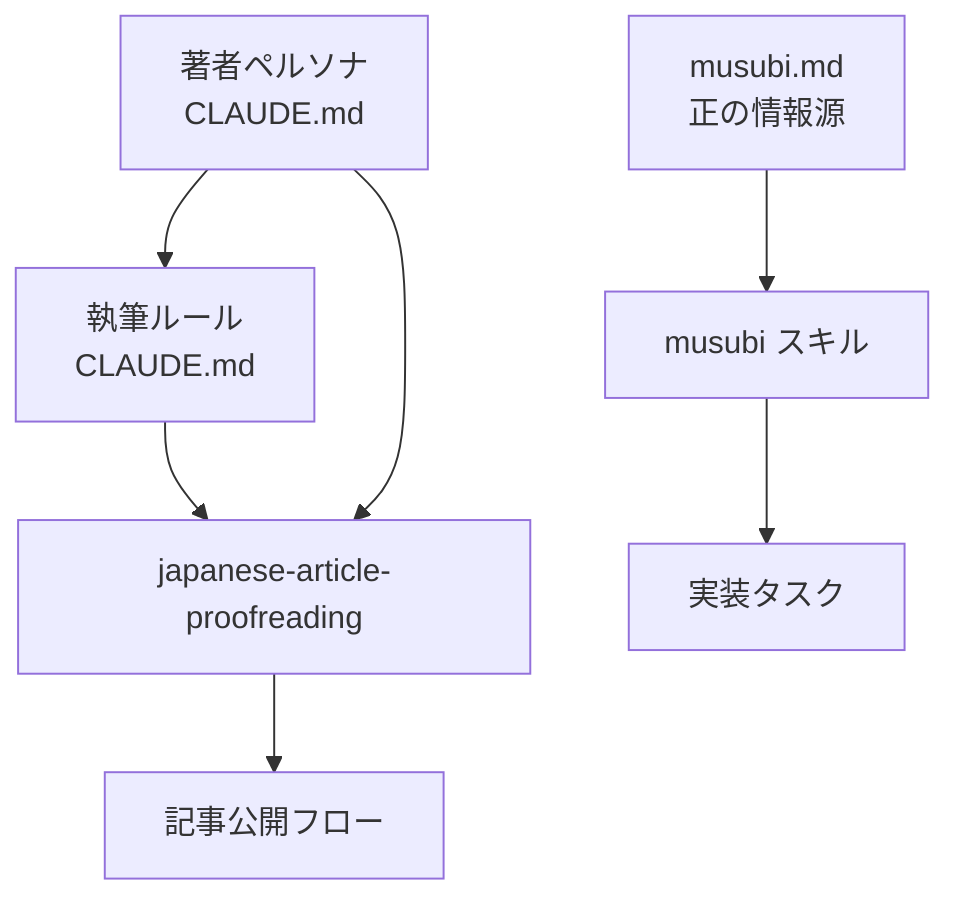

CLAUDE.mdに記事執筆ワークフローを書いていて、ふと気づいたことがあります。

```text
0. ペルソナを読む
1. 執筆ルールを読む
2. SKILL.mdの校正重点項目を読む
3. 記事を書く
4. /japanese-article-proofreading で校正
5. textlintエラー0確認
6. push
```

これ、依存関係のあるグラフじゃないかと。

## スキルの「暗黙の前提」

以前の記事でClaude Codeのスキル設計について書きました。`.claude/skills/` にSKILL.mdを置くと、エージェントがタスクに応じて自動的に読み込む仕組みです。

https://zenn.dev/imudak/articles/ai-agent-skill-design

今のスキル構成はこんな感じです。

```text
.claude/skills/
├── musubi/SKILL.md
├── japanese-article-proofreading/SKILL.md
├── japanese-markdown-proofreading/SKILL.md
└── notebooklm/SKILL.md
```

それぞれ独立したファイルとして管理しています。でも実際に使うと、スキルは独立していません。

`japanese-article-proofreading` は著者ペルソナを知っていないと機能しません。ペルソナはCLAUDE.mdに書いてあります。スキルとCLAUDE.mdの間に依存関係がある。でもそれはファイルのどこにも明示されていない。

MUSUBIスキルも同様で、スキル本体にはこう書いてあります。

```markdown
正の情報源: `~/projects/flow-manager/docs/flows/musubi.md`（作業前に必ず読むこと）
```

musubi.mdを読まないとMUSUBIスキルは半分しか動きません。ここにも依存関係があります。

## Skill Graphs という考え方

**Skill Graphs** は、個々のスキルを単体ファイルとして管理するのではなく、グラフ構造（依存関係・組み合わせ）で体系化するアプローチです。

ノードがスキル、エッジが依存関係です。



今の構成でもこのグラフは存在しています。ただし暗黙的に。

## 暗黙のグラフを可視化すると何が変わるか

グラフを明示すると、2つのことができるようになります。

### 依存先の変更が影響範囲をたどれる

著者ペルソナを変更したとします。今の構成では、それが何のスキルに影響するかを追うには全スキルを読み直すしかありません。グラフが明示されていれば、ペルソナノードから辿って影響するスキルが一覧できます。

### スキルの組み合わせが予測できる

`japanese-article-proofreading` を使うには事前に著者ペルソナが読まれていること、という前提条件をグラフで表現できます。エージェントがスキルを選ぶとき、前提条件が満たされているかを確認できるようになります。

逆に今の構成だと、記事校正をお願いしたのにペルソナを渡し忘れた、という状況が起きます。実際に何度かありました。

## OpenClawのスキル設計への応用

OpenClaw（AIエージェント基盤）のスキルも同じ構造を持っています。

```text
~/.openclaw/workspace/skills/
├── musubi/SKILL.md
├── japanese-article-proofreading/SKILL.md
└── ...
```

現状はスキルが平坦に並んでいます。タスクのdescriptionを見てエージェントが選ぶ仕組みですが、複数スキルが連携するタスクでは「どれを先に読むか」「何が前提か」が暗黙になっています。

Skill Graphsを取り入れるとすれば、SKILL.mdのフロントマターに `requires` フィールドを追加するくらいから始めることになりそうです。

```yaml
---
name: japanese-article-proofreading
description: "Zenn技術記事を校正します。..."
requires:
  - persona
---
```

エージェントがこのフィールドを読んで、必要な依存スキルを先にロードする——という動きです。今のOpenClawの実装がそこまで対応しているかはわかりませんが、設計として頭に入れておく価値はあります。

## 現時点での対処

グラフ構造の実装を待たずに、今できる対処として2つやっています。

1. **CLAUDE.mdでワークフローとして明示する**
   スキルの依存関係を記事執筆ワークフローの手順として書き下す。エージェントへの指示になると同時に、自分への備忘録にもなる。

2. **スキルの冒頭に前提を書く**
   SKILL.mdの先頭に「このスキルは著者ペルソナ（CLAUDE.md参照）の知識を前提とします」と明記する。グラフ構造ではないが、読めばわかる。

スマートではないですが、今の仕組みの中でできる最低限の対処です。

## まとめ

スキルを1ファイル1機能で管理するのは自然な出発点ですが、スキルが増えると暗黙の依存関係が積み上がってきます。

Skill Graphsという考え方は、その暗黙を明示にするアプローチです。実装がついてくるかどうかはツール次第ですが、「スキルをグラフとして設計する」という思考自体は今すぐ使えます。

自分のスキル構成を図に描いてみると、思っていた以上に依存関係がありました。
