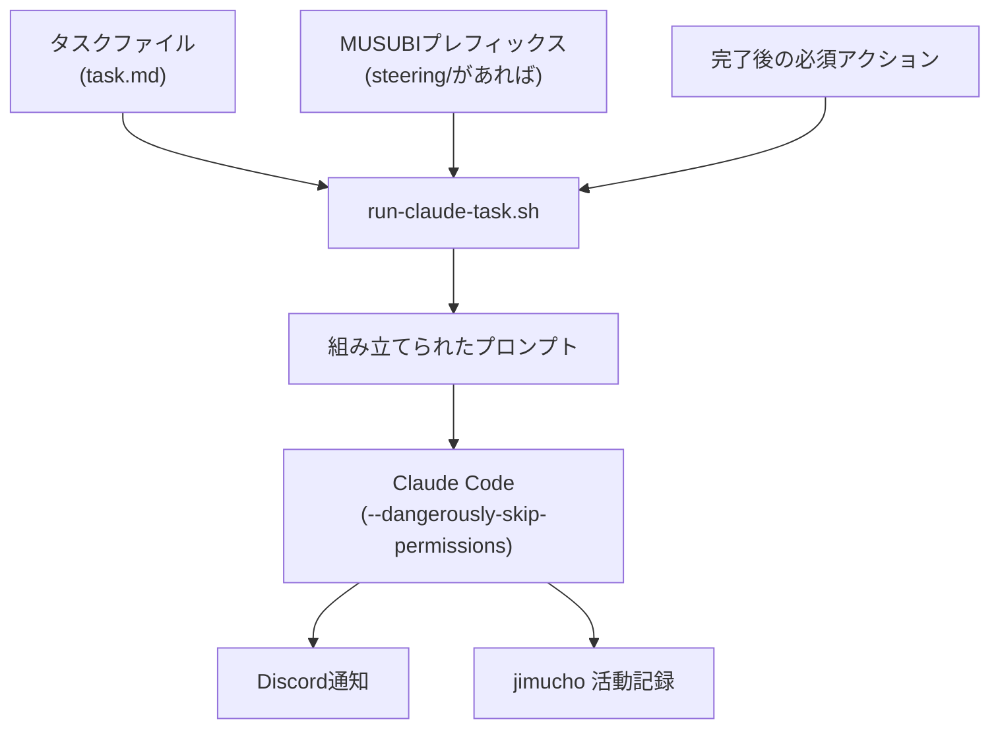

## タスクファイルを `/tmp/task.md` に置いて叩くだけ

```bash
run-claude-task.sh --thread-id 1234567890 ~/projects/jimucho /tmp/task.md "jimucho: 認証機能実装完了"
```

これを実行すると、Claude Codeが起動し、タスクを完走し、Discordに完了通知が届きます。途中で止まったかどうかはログで確認できます。

これが今の運用です。40件ほどのプロジェクトをAIに並走させていますが、タスクの起動インターフェースはこれに集約しています。

## run-claude-task.sh が何をするか

スクリプト本体は `~/bin/run-claude-task.sh` に置いています。主な仕事はこれです。

1. タスクファイルを読み込んでプロンプトを組み立てる
2. プロジェクトに `steering/` があればMUSUBIプレフィックスを自動付与する
3. 完了後の必須アクション（バージョン管理のプッシュ、nextAction更新）を末尾に追記する
4. `claude --dangerously-skip-permissions -p "${PROMPT}"` でClaude Codeを起動する
5. 完了したらDiscordに通知し、jimuchoに活動記録を残す

タスクファイルには「何をするか」だけ書けばよく、「完了後にjj pushして」「nextActionを更新して」は毎回自動で付与されます。



## タスクファイルの書き方

タスクファイルはMarkdownで書きます。スクリプトが末尾にアクション指示を追記するので、タスク本体に書くのは「何をするか」だけです。

実際に使ったタスクファイルの例です。

```markdown
## 必須: まずCLAUDE.mdを読め

~/projects/jimucho/CLAUDE.md を全文読んでから作業を開始すること。

## 対象機能

onegai（依頼管理）APIに検索フィルタを追加する。

## 要件

- `GET /api/onegais?status=pending` でステータスフィルタ可能にする
- `GET /api/onegais?keyword=Claude` でキーワード検索可能にする
- 既存テストは全PASS維持
- musubi-gaps detect で0件確認

## 完了条件

- `npm test` 全PASS
- `musubi-gaps detect` の結果が0件
```

「CLAUDE.mdをまず読め」という一行は、プロジェクト固有のルールをAIへ確実に読ませるための指示です。これを省くと、以前のバージョンのルールで動いてしまうことがありました。

## MUSUBIプレフィックスの自動付与

プロジェクトのルートに `steering/` ディレクトリがある場合、スクリプトが以下のプレフィックスを自動でプロンプトの先頭に追加します。

```text
### MUSUBIフロー遵守
- 各ステップでsteering filesを参照
- EARS形式で要件を記述（EARSキーワードは英語: When, the system shall）
- constitution.mdに準拠（特にArticle III: Test-First）
```

この仕組みにより、MUSUBI対応プロジェクトでは「steering/を参照しながら仕様→実装のフローを回す」という動作がデフォルトになります。タスクファイル側でMUSUBIの指示を書く必要はありません。

スクリプト内の判定はシンプルです。

```bash
if [ -d "${PROJECT_DIR}/steering" ]; then
  MUSUBI_PREFIX=$(cat <<'MUSUBI'
### MUSUBIフロー遵守
...
MUSUBI
)
fi
```

MUSUBI対応かどうかをタスクファイルの書き手が意識しなくていいのは、地味に便利です。

## 完了通知の仕組み

Claude Codeの完了後、スクリプト自身が通知と活動記録を残します。

```bash
# Discordスレッドへの完了通知
openclaw message send --channel discord --target "${THREAD_ID}" \
  --message "${COMPLETION_MSG}"

# jimuchoへの活動記録
curl -s -X POST http://localhost:3100/api/activities \
  -H "Content-Type: application/json" \
  -d '{"type":"decision","level":1,"category":"go_nogo","message":"...","outcome":"completed"}'
```

「LLMに完了後の通知もやらせればいい」という発想で最初に作りましたが、これは失敗でした。LLMがプロンプトの末尾の指示を見落としたり、Discordのツールを起動する前にセッションが終わったりすることがあります。

通知はラッパースクリプトが確実に実行するほうが安定します。失敗時も `[FAILED exit:1]` というプレフィックス付きで通知が来るので、問題の見落としが減りました。

## 止まった時の確認

Claude Codeが途中で止まった場合、ログファイルで状況を確認します。

```bash
# 最新のログファイルを確認
tail -f /tmp/claude-task-20260301-143000.log
```

ログにはClaude Codeの出力が全て記録されています。exitコードも記録されるので、正常終了か異常終了かはすぐわかります。

```text
[run-claude-task] claude started at Sat Mar  1 14:30:00 JST 2026
[run-claude-task] prompt size: 1842 bytes
...（Claude Codeの出力）...
[run-claude-task] claude exited with code 0 at Sat Mar  1 14:35:22 JST 2026
```

また、同時実行を防ぐための排他ロックが入っています。複数のcronジョブが重なって実行された場合、後から来たジョブは前のジョブが終わるまで待機します。「同時に2つのClaude Codeが動いてコードを壊す」という事故は、これで防いでいます。

## DRY_RUNで確認してから実行

初めてのタスクファイルを使うときは、実際に起動する前に組み立てられるプロンプトを確認できます。

```bash
DRY_RUN=1 run-claude-task.sh --thread-id 1234 ~/projects/jimucho /tmp/task.md
```

出力例です。

```text
=== [DRY_RUN] 組み立てられたプロンプト ===
### MUSUBIフロー遵守
...（自動付与されたプレフィックス）...

## 対象機能
...（タスクファイルの内容）...

### 完了後の必須アクション（必ず実行すること）
...（自動付与された後処理指示）...
=== [DRY_RUN] プロジェクト: /home/imudak/projects/jimucho ===
=== [DRY_RUN] 通知先: Discordスレッド 1234 ===
=== [DRY_RUN] 実際のclaude起動はスキップされました ===
```

タスクファイルを書いたあとDRY_RUNで確認する習慣をつけてから、「プロンプトが意図と違っていた」系のミスが減りました。

## まとめ

run-claude-task.shでやっていることはシンプルです。

- タスクファイル＋自動付与のプレフィックス・後処理でプロンプトを組み立てる
- `claude --dangerously-skip-permissions -p` で起動する
- 完了通知はスクリプト自身が確実に実行する

タスクファイルの記述が整理されていれば、ほぼノータッチで仕様→実装のサイクルが回ります。Discordに完了通知が来てから確認するだけ、という運用になっています。

タスクを「どう書くか」がそのまま完走率に直結するので、完了条件を具体的に書くこと（`npm test 全PASS`、`musubi-gaps detect 0件` など）が今のところ一番効いています。

## 関連記事

https://zenn.dev/imudak/articles/musubi-not-really-using-it

https://zenn.dev/imudak/articles/ai-autonomous-workflow-delegation
